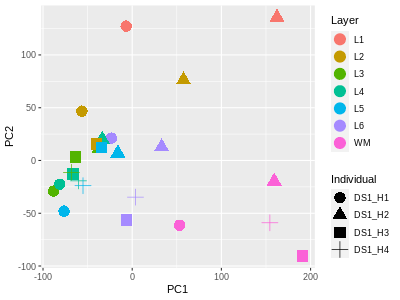
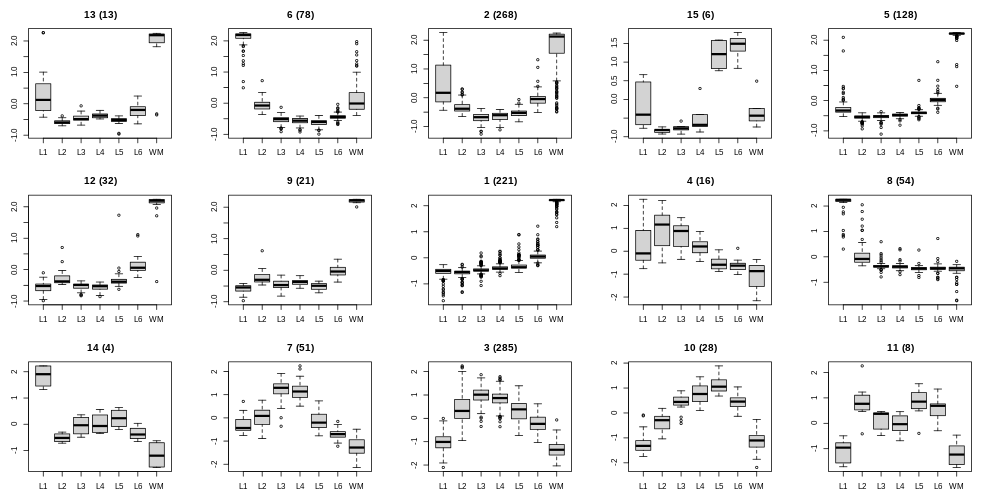

# Tutorial for bulk RNA-seq data preprocessing and analysis
#### Compiled by Zhisong He
#### Updated on 15 Sept 2022
### Table of Content
  * [Introduction](#introduction)
  * [Preparation](#preparation)
    * [1-1. Linux and Bash, your important buddies for RNA-seq data analysis](#1-1-linux-and-bash-your-important-buddies-for-rna-seq-data-analysis)
    * [1-2. Access the computing server](#1-2-access-the-computing-server)
    * [1-3. Install the required tools with the help from conda](#1-3-install-the-required-tools-with-the-help-from-conda)
    * [1-4. Get the public RNA-seq data from SRA](#1-4-get-the-public-rna-seq-data-from-sra)
  * [Preprocessing of RNA-seq data](#preprocessing-of-rna-seq-data)
    * [2-1 Quality control of RNA-seq data](#2-1-quality-control-of-rna-seq-data)
    * [2-2 Read mapping/pseudomapping and quantification](#2-2-read-mappingpseudomapping-and-quantification)
      * [2-2-1 Read mapping with STAR and data quantification](#2-2-1-read-mapping-with-star-and-data-quantification)
      * [2-2-2 Read pseudomapping with kallisto and data quantification](#2-2-2-read-pseudomapping-with-kallisto-and-data-quantification)
    * [2-3 Cross-species comparison](#2-3-cross-species-comparison)
  * [Analyze and compare RNA-seq data](#analyze-and-compare-rna-seq-data)
    * [3-1 Introduction to R](#3-1-introduction-to-r)
    * [3-2 Import data to R](#3-2-import-data-to-r)
    * [3-3 Comparison of transcriptomic profiles across samples](#3-3-comparison-of-transcriptomic-profiles-across-samples)
    * [3-4 Differential expression analysis](#3-4-differential-expression-analysis)
	  * [ANOVA and ANCOVA](#anova-and-ancova)
	  * [DESeq2](#deseq2)
	* [3-5 Grouping of the identified DEGs](#3-5-grouping-of-the-identified-degs)

## Introduction
<sub><a href="#top">(Back to top)</a></sub></br>
Nowadays in biology, the RNA sequencing technology becomes so commonly used that it may not even need much of the introduction. Based on the high-throughput DNA sequencing techniques, the RNA sequencing technology, or RNA-seq in short, measures the presence and quantity of RNA in a biological sample by firstly converting the captured RNA transcripts to cDNA via reverse transcription. Unlike the other techniques which also quantify the transcript abundance (e.g. qPCR), RNA-seq can unbiasedly quantify RNA abundance in the transcriptome level at the same time, and in addition allows the discovery of novel transcripts in a sample.

On the other hand, no RNA-seq experiment would automatically inform any of those biological insights directly. What an RNA-seq experiment gives you is a bunch of "reads", which are the short fragmented sequences that are captured, fragmented, reverse transcribed and measured. One would have to process the data to quantify the abundance of transcripts from every gene, and then further analyze the resulted data. This is what this tutorial is supposed to tell you.

In the following sections, we will go through the RNA-seq data preprocessing including quality control, mapping and quantification, and then the data analysis such as sample/condition comparison, identification of differentially expressed genes among conditions, and the possible following analysis to interpret the identified differences. Before that, I will also mention some more basic concepts and operations such as how to use the command line interface in a Unix-like system like Linux, how to install the software needed for the procedure, and how to download public RNA-seq data from the SRA data repository.

## Preparation
<sub><a href="#top">(Back to top)</a></sub></br>
In this section, I will mention the stuffs before we even start preprocessing the RNA-seq data, so that you can make sure that you and your computers are both ready for the way afterwards. These stuffs include the followings:
1. Linux and [Bash (the Bourne Again SHell)](https://www.gnu.org/software/bash/), the most commonly used command line interface in Linux
2. How to access a computing server via SSH
3. Conda and how to use it to install software needed for the data preprocessing
4. SRA and how to retrieve the public RNA-seq data from there

### 1-1. Linux and Bash, your important buddies for RNA-seq data analysis
<sub><a href="#top">(Back to top)</a></sub></br>
I'm pretty sure you know computer and use computer (otherwise you won't be able to see this). However, you may not ever use Linux OS (Linux for short) even though you may have heard of the name somewhere. Meanwhile, you must be very familiar with Microsoft Windows and/or Apple macOS. These three falls into the same concept: the operating system (OS) of a computer. An OS is probably the most important software on a computer, which manages computer hardware, software resource and provides services for other programs. It runs at the lowest level, and everything else you use on the computer relies on it. On desktop computers or laptops, Microsoft Windows and Apple macOS are the two most commonly used OS. However, this is not the case for other computers such as computing servers and high-performance clusters (HPC), which are important foundations of the nowaday data science, and of course, bioinformatics. For those computers, Linux is of much higher preference, for its computing efficiency, flexibility, stability, and security. Indeed, more than 90% of the world's fastest supercomputers run on Linux, and because of that, people relying on high-performance computing develop lots of tools that can be quite easily set up in Linux but not necessarily in the other two OS, which also contributes to the bias of choice.

As one of the fields that require high-performancing and large-resource computing, bioinformatics and computational biology also heavily uses Linux. Actually, <ins>**many software needed for the RNA-seq data preprocessing are only available in Linux**</ins> (and other Unix-like systems, but won't be further mentioned in this tutorial). Therefore, some basic understanding of how to use Linux is critical.

>**NOTE**
>* Unix is a family of multitasking, multiuser computer operating systems that derive from the original AT&T Unix, and are characterized by a modular design (Unix philosophy). Different components work together, with the kernel being the center to provide the most basic management and support. Unix is not free, but it inspired the development of many free Unix and Unix-like OS, and importantly, the GNU (meaning GNU's Not Unix) project and the Linux kernel which later on further derived into different Linux distributions (like different branches or versions of Linux). Among them, Red Hat Enterprise Linux (RHEL), Fedora, CentOS, SUSE Linux Enterprise, openSUSE, Debian, Ubuntu, Linux Mint and Arch Linux are among the most famous ones.
>* Actually the Apple macOS (since version 10.5 with 10.7 Lion as the exception) is a UNIX 03-compliant OS certified by The Open Group, so although not a Unix-like (meaning look like Unix but is not been certified, e.g. Linux) but a UNIX. This is also the reason why macOS in prefered in relative to Windows if you have to use your desktop/laptop for the task.

From our side as the computer end users, we don't need to care too much about how different OS work at the low level. However, we need to interact with the OS, for instance, to ask it to open a software or whatever, and that varies a lot from one OS to another. Windows and macOS look very different and we know that. When switching from one to the other for the first time, most of us would need quite a long time to get used to everything. However, that usually wouldn't be too difficult as both OS have pretty and straightforward graphical design for you to interact with the system. This is called a graphic user interface (GUI). Linux also have GUI, and different Linux distributions have different ones. However, what is different from Windows and macOS is that the GUI is not essential for Linux. For many computers running on Linux, especially those for high-performance computing, the GUI components are not even installed. Instead, people using those computers rely on CLI, which is short for command-line interface.

<p align="center">

<br/><sub><i>Image adapted from https://www.onetekno.my.id/2021/12/perbedaan-gui-dan-cli.html.</i></sub>
</p>

CLI has a much steeper learning curve than GUI, and that's exactly the reason why GUI was developed in response to the complain to CLI. So why are we still using CLI heavily?That was also a question I had at the beginning, but after using CLI for a while and finally getting into it, I realized at least several reasons.

1. <ins>**The fancy graphic view comes with cost**</ins>. Computing and displaying all the visual changes on the screen needs resources (the computing unit CPU and/or GPU, memory, and also the storage). When doing high-performance computing which requires a lot of resource, however, we would for sure want to maximize the resource we can use for the real computation we want to do rather than just to display a mouse cursor moving around. Don't underestimate how much this would have needed, especially keep in mind that many computing servers and HPCs are not just been used by just one person at a time, and one person may have many things running at the same time. With a GUI for every user at least would use tremendous amount of computer resource.
2. While the GUI can only do what the developers implemented explicitly, <ins>**the CLI is easy to program to work out something more complicated or repetitive**</ins>. For instance, renaming 1000 files with a similar manner (e.g. to rename everything from A\*\*\*\* to B\*\*\*\* while keeping the \*\*\*\* part the same) can be quite easily done in CLI using the basic rename command together with basic programming skills in several lines of commands, but you would probably need to find a tool specifically implemented for batch renaming to do that in GUI. One can also combine different steps which use different tools together quite easily in CLI, much easier than using GUI. Such kinds of operations are very common when dealing with large data (e.g. preprocessing a RNA-seq data set with 10 samples using the same pipeline).
3. <ins>**Developing GUI for software needs a lot of effort**</ins>. Designing and implementing a nice GUI for a program can take as much time as, if not more than, implementing the functional part of the program. For tools which are mostly used by CLI-familiar users, it doesn't make sense from the developer's perspective to implement the GUI. If all the tools running on the OS only use CLI, the GUI of the OS is not really that useful anymore.

Learning and getting used to CLI would be pretty tough at the beginning, but it is far from doing something impossible, and you would probably like it once you get familiar with the commands and learn a bit of the simple programming skills. It takes time and effort of course, but stay patient and believe in yourself that you can do it! 

Before going to the HOW-TO part, do keep in mind that there are different CLIs for different OS (yes, Windows and macOS both have CLI as well). And there are different CLIs implemented for even the same OS. For Windows, there are the Command Prompt which emulates many of the command line abilities available in MS-DOS (Microsoft Disk Operating System, the old OS with only CLI by Microsoft), and the new PowerShell which provides extended capacities of the Command Prompt. For UNIX and Unix-like OS including Linux and macOS, there are different types of Shell including C shell (csh), Bourne Again shell (Bash), and Z shell (zsh), an extension of Bash. In most of the time, Bash is the default CLI for a Linux regardless different distributions, while zsh is currently the default shell for macOS.

Here let's focus on Bash, and go through a few commonly used commands in Bash. Please see it as a start of getting into using Bash in Linux, not the end. If you would like to dedicate yourself a bit into data analysis, knowing more than the most basic commands would be very useful and important. For instance, the scripting function is extremely useful to wrap up different operations into one pipeline and apply to multiple objects (like files), but this won't be covered here (otherwise this would become a Bash tutorial than RNA-seq data analysis). There are many great books introducing Bash commands and scripting, so as many resources available online. You can quite easily get the information online.

>**NOTE**
>* The term "shell" here means a computer program that presents a CLI that allows you to control your computer using commands entered with a keyboard instead of controlling GUIs with a mouse/keyboard/touchscreen combination.
>* The term prompt refers to what you see when the CLI is waiting for your command. In Bash it is`$` by default but customizable.
>* The Windows CLIs has a lot of differences compared to the shells used in Linux, and we won't talk about it here.

Here are some of the most commonly used Bash commands, most of which are pre-installed in any commonly used Linux distribution:

| Command | Abbrev. | Function |
|---------|---------|----------|
|`ls`|list|list files, by default files in the current working folder, but could also be those at a given location or those with their paths following a certain pattern.|
|`cd`|change directory|change the working folder|
|`pwd`|print working directory|print the current working directory|
|`touch`|touch|update the access and modification times of the given file to the current time. Usually it is used to create an empty file by providing a file name that points to no file at the moment|
|`cp`|copy|copy a file or files to a different path (could be a file named the same or differently in another folder, or a different file name at the same folder)|
|`rm`|remove|delete the given file(s)|
|`mv`|move|move a file or files to a different path, or to rename it/them. Similar to firstly do `cp` and then `rm`|
|`mkdir`|make directory|create a new and empty folder at the current working folder or the given path|
|`rmdir`|remove directory|remove the given folder(s). Note that this only applies to empty folders|
|`chmod`|change mode|manage the access permissions of a file|
|`cat`|concatenate|output the content of one or multiple files. When multiple files are given, the contents are concatenated (that's what the name is for)|
|`less`| |view the contents of a text file, one screen at a time. One can use the PgUp and PgDn buttom to go forward or backward|
|`echo`|echo|print the given strings|
|`gzip`|GNU zip|compress or decompress a single file (directory not allowed) based on the gzip file format|
|`tar`|tape archive|collect many files into one archived file (tarball), or to release the files from the given tarball|
|`which`|which|print the location of the given executable|
|`wget`|www get|download files via HTTP/HTTPS/FTP from Internet, given the link to the files|
|`ssh`|secure shell|remotely login and access another computer using the SSH network communication protocol|
|`scp`|secure copy|transfer files between the local computer and the remote |
|`wc`|word count|count the number of characters, words and lines in a file or files|
|`top`|table of processes|display information about CPU and memory utilzation in total and per process|
|`screen`|screen|open one or more virtual screens which can be stayed in the background while keeping commands going on even if the virtual screen is disconnected|
|`tmux`|terminal multiplexer|very similar to `screen`, just another option|
|`nano`||an easy-to-use text editor|
|`vim`|vi improved|a commonly used modal text editor, which operates in either insert mode (where typed text becomes part of the document) or command mode (where keystrokes are interpreted as commands that control the edit session)|

>**NOTE**
>Any command you can run in Bash is essentially a program. On the other hand, any program which is executable in Bash, including those implemented separately from Bash, can be also seen as a command there.

All those commands have different options and arguments. In most of the time, they are arranged in a way like following:
```console
$ <command> [options] [arguments]
```

Here, `arguments` represent one or multiple things (e.g. the path to a file, the link to a file on Internet) as the given input to the command, and it is often required unless the command provides a default value (e.g. `ls` has the default argument `.` which means the current working directory). Meanwhile, `options` are the parameters specific to commands which change the behavior of the command. For instance, the `ls` command has many `options`, such as `-a` for displaying all files including the hidden ones, and `-l` for showing the detailed information of all files with each line per file. Note that it is possible that certain `options` changes the command behavior so that no `argument` is anymore expected. The common example is the `-h` or `--help` option which usually asks the command to show the brief or detailed description of possible `options` and the expected `arguments`. For instance, running `ls --help` shows the following (it is too long so only the beginning is shown here):

```console
$ ls --help
Usage: ls [OPTION]... [FILE]...
List information about the FILEs (the current directory by default).
Sort entries alphabetically if none of -cftuvSUX nor --sort is specified.

Mandatory arguments to long options are mandatory for short options too.
  -a, --all                  do not ignore entries starting with .
  -A, --almost-all           do not list implied . and ..
      --author               with -l, print the author of each file
  -b, --escape               print C-style escapes for nongraphic characters
      --block-size=SIZE      scale sizes by SIZE before printing them; e.g.,
                               '--block-size=M' prints sizes in units of
                               1,048,576 bytes; see SIZE format below
  -B, --ignore-backups       do not list implied entries ending with ~
  -c                         with -lt: sort by, and show, ctime (time of last
                               modification of file status information);
                               with -l: show ctime and sort by name;
                               otherwise: sort by ctime, newest first
  -C                         list entries by columns
      --color[=WHEN]         colorize the output; WHEN can be 'never', 'auto',
                               or 'always' (the default); more info below
  -d, --directory            list directories themselves, not their contents
```

Another way to view the detailed description of a command is to use the `man` command, which displays the manual of the given command if the manual is available. For instance, running `man ls` shows the system manual of the `ls` command. And of course, you can run `man man` to see the manual of the `man` command.

>**NOTE**
>In the manual page by `man`, use PgUp and PgDn to scroll, and q to quit. The same way also applies when you use the `less` command to view a text file.

Some simple examples of full command lines in Bash:

|Command|Function|
|--------|--------|
|`cd folder`|change the working directory to the `folder` directory at the current working directory|
|`cd /tmp`| change the working directory to `/tmp`|
|`ls`|display files in the current working directory|
|`ls -l`|display files in the current working directory with detailed information|
|`ls -al`|display all files, including the hidden ones, in the current working directory with detailed information|
|`ls -hl`|display files in the current working directory, with the file size displayed in a human-readable format|
|`ls /tmp`|display files in the `/tmp` directory|
|`cp file1 file2`|make a copy of the file `file1` in the current working directory as the `file2` file in the same folder|
|`cp file1 /tmp`|make a copy of the file `file1` in the current working directory in the `/tmp` folder with the same name|
|`cp file1 /tmp/file2`|make a copy of the file `file1` in the current working directory as the `file2` file the `/tmp` folder|
|`cp -r dir1 /tmp/dir2`|make a recursive copy of the folder `dir1` as the folder `dir2` in the `/tmp` folder|
|`rm file1`|delete the file `file1` in the current working directory|
|`rm -r dir1`|delete the folder `dir1` and all its contents in the current working directory|
|`gzip file1`|compress `file1` to `file1.gz`|
|`gzip -d file1.gz`|decompress `file1.gz` to `file1`|

Before ending this section, there are several extra things that I think should worth a mentioning.

#### About the file system in Linux
One thing is the file structure in Linux and other Unix-like and UNIX OS (such as macOS). Files are always organized in a hierarchical manner, with the top level being the root `/`. Under `/` there are different directories, each is specifically for one purpose. For instance, `/home` contains all the user home folders, `/usr` contains most of the commands and software accessible to all users, `/tmp` is the default temporary folder to store temporary files. To represent a file under a certain folder, concatenate the file name with its higher hierarchy by `/`, e.g. `/home/user1`, and this is called the absolute path to a file. There is also the relative path, meaning the path of a file in relative to another file (in most of the time the current working directory). This would need to include `.` for the current working directory, and `..` to represent the previous hierarchy (or the parent directory) of the current working directory. For instance, assuming the current working directory is `/home/user1`, then `../user2` means the file `/home/user2`. By the way, the terms "directory" and "folder" are somehow equivalent here.

You may have also noticed that I use the term "file" to represent not only the literally files, but also directories. Indeed in Linux, everything is represented or can be seen as a file. This not only include directories, but also hardware devices being attached and recognized. They are all seen and managed as special files with some special behaviors.

#### About the filename patterns
And when talking about the file names, one doesn't always need to provide the exact file name. Alternatively, one can represent a file, or a set of files, using the so-call glob patterns that specify a set of filenames following similar patterns with wildcard characters. Those wildcard characters are like placeholders with just one character. The commonly used ones include
 * the asterisk character `*` (or "star"), which represents zero or more of any characters
 * the question mark `?`, which represents exactly one of any character
 * the enclosed square branckets `[...]` with a set of characters in between (e.g. `[ab]`), which represent a single character that matches within the set
 * the exclamation mark within the enclosed square branckets as the first character `[!...]` (e.g. `[!ab]`), which represent a single character that matches with any character that's not in the set

Using those wildcard characters we can easily represent many different filenames that share a similar pattern. For instance, `a*` means any file starting with "a", `*a*` means any file with an "a", `*a` means any file ending with "a", `a*a` means any file starting with "a" and ending with "a", `a?a` means any filename with three characters in which the first and the last one being "a", `a[abc]a` means the set of `aaa`, `aba` and `aca`. And just to clarify, different wildcard characters can be used together, so we can have something like this `a[abcd]??[0123]*.txt`. The glob pattern can be used as `arguments` of many commands that expect one or multiple filenames, e.g. `ls` (`ls -l *.csv`, list all files ends with ".csv") and `cp` (`cp *.txt /tmp/`, copy all files end with ".csv" to the `/tmp` directory)

#### About redirection and piping
After running a certain command in Bash, you usually see the output printed on the screen. However, sometimes you would want to store all those results to a text file. This is possible by using  the redirection function in Bash, which is activated by using `>` after a command:

```console
<command> [options] [arguments] > [file]
```

For instance, you can save the output of `ls -l` to the file "ls.txt" by doing `ls -l > ls.txt`. This doesn't seem to be very useful, but the redirection function could become very useful in some scenarios. For instance, the `gzip -d` function decompresses a .gz file and afterwards the .gz file will be automatically removed. The `gzip` command has another option (`-c`) to print the compression/decompression results to the screen. So if you want to decompress a .gz file and save the decompressed context to a new file while keeping the .gz file, you can use the redirection function as

```console
gzip -cd example.txt.gz > example.txt
```

>**NOTE**
>There are two types of output to the screen, one is called "stdout" (standard output) while the other one called "stderr" (standard error). There is also the "stdin" (standard input) which is usually the input from the keyboard. Formally they are called standard I/O streams, I/O means input/output, and streams here represent the flow of information. For the two standard output streams, stdout is usually the real output while stderr is usually for verbose, warning, or error message. The simple `>` only save stdout to the file. If you want to save the stderr, `2>` instead of `>` should be used, where "2" represents stderr. And by the way, as you may have guessed, "1" represent stdout, so you can also use `1>` which is actually the same as using `>` directly.

Besides, there is another important feature of Bash, the pipes, indicating by `|`. It is a bit similar to redirection, but instead of saving the output to a file, it directly use the output of one command (which would be printed to the screen if you just run that command directly) as the input of the next command. This could be extremely useful to combine multiple commands for some complicated operations without the need to generate any intermediates.

```console
<command1> | <command2>
```

For example, the `ls` command has the option `-1` to print one file per line. Meanwhile, the `wc` command has the option `-l` to only output the number of lines in the given file or the piping input. We can therefore combine them two using the pipes

```console
ls -1 | wc -l
```

In this combination, the output of `ls -1` becomes the input of `wc -l`, so the number of lines in the `ls -1` is printed. As the line number of `ls -1` is the same as the number of files in the current working directory, the final output actually tells you how many files there are in the current folder.

>**NOTE**
>One can do multiple piping to build a pipeline. Of course, that would require that every command being used in the pipeline supports the use of stdin as the input and can output their results to stdout so that it can be piped into the next command.


#### About Bash scripting
Do keep in mind, that Bash can do much more complicated things than what have been mentioned above. It supports scripting, which allows a series commands being put together, plus the additional logic operators, for loops, conditional statements and so on. So you can actually see Bash as a programming language. Indeed, this is probably the most critical and valuable part of Bash. If you want to be an expert on Bash, this is what you have to learn.

Specifically for the main topic of this tutorial, to preprocess and analyze RNA-seq data, this would also be very helpful even with some simple knowledge on it. For example, assuming you have the data of 20 different RNA-seq samples and you know the preprocessing pipeline, you can of course apply the pipeline to each sample one by one, to manually start the next one after seeing the previous one being done, but this is clearly not the optimal way as you don't want to look at the screen 24\*7. And no need to mention when you have 200 samples instead of 20. This can be however easily managed with looping through the samples, so that every time one sample is being processed and the next one would be automatically started when the previous one is finished.

However, there are so many stuffs one would have to talk about the scripting in Bash, as many as introducing a programming language, it won't be covered further here. Meanwhile, there are lots of great materials one can find online (for instance, this [cheatsheet](https://devhints.io/bash)), as well as books. If possible, I would really encourage you to check and get a bit into it, and very likely you won't regret.

### 1-2. Access the computing server 
<sub><a href="#top">(Back to top)</a></sub></br>
It is most likely that you are using your own computer right now looking at this tutorial, and you might be now thinking to use it for the RNA-seq data preprocessing and analysis, at least to go through the remaining part of the tutorial. This may not be a good idea, as your own computer, which is very much likely to be an ordinary desktop or laptop. However, while it could have been powerful enough for daily usage for sure and maybe also to play fancy AAA games without frame drops, it may not be enough for going through every step in the tutorial. Different tasks need different resources. A powerful graphics card is critical for gaming and on top of that, an Intel Core-i9 12th gen with 16 cores plus 16GB RAM (memory) would have made your computer powerful enough for most games. On the other hand, for most of the preprocessing and analysis of RNA-seq data, at least those will be mentioned in this tutorial, no graphic card would be needed at all, while RAM would become a main issue, that 64GB or more would be expected to get everything done; 16 cores CPU would be probably enough in most of the time, but sometimes during the analysis you may want to use large-scale parallelization to speed things up, and start to hope for availability of 100 cores.

Therefore, we rarely use personal computers for the data analysis. Instead, we use high performance computing servers or clusters. They are machines with large number of CPU cores and memories, and usually shared by many users who can all access and use the machine at the same time. And of course, this "access" would no longer be the physical access sitting in front of its screen and type directly on its keyboard. Actually many of those machine has no screen and keyboard (and of course no mouse as well) attached. Then how shall we use them?

The solution has actually mentioned somewhere above. Basically all of those machines supports remote access via the SSH (Secure Shell) protocol. Under that protocol, the server provides the service as a server, and we the users are the clients that try to request the services. The way to do this request varies depending on the OS you use at your personal computer.

#### If you are a macOS/Linux/other UNIX/Unix-like OS user
In the CLI provided by the UNIX or Unix-like OS, including macOS and different Linux distributions, the `ssh` command is usually installed from the beginning, which you can use to access another machine via SSH protocol. The way of using it is simple. You can open the CLI at your computer (e.g. the app Terminal in macOS), and then run the `ssh` command in the following manner:

```console
ssh <username>@<hostname>
```

Here you would need to make sure you have a username or account name available at the server, so as the name of the server (hostname). Also you need to make sure that your personally computer and the server is in the same network (e.g. to use the servers in ETHZ, you should make sure you are using the ETH network via WIFI or network cables in the campus, or you should use the ETH VPN), otherwise the computer won't be able to understand and connect to the right machine. Without other additional setup, the server will then respond by asking you for the password. If the server is working, your account is valid on the server, and the username and password you input match, you can likely see some welcoming message, and a new line with the prompt waiting for your command in the server.

For the students attending the Systems Genomics course, there is the student server for you to work on your drylab task. The server is called "bs-studentsvr04" as its hostname. The username to login the server is your ETH username, while the password being the one you use also for your email and most of the ETH services.

```console
ssh <username>@bs-studentsvr04
```

You would hopefully see the following, suggesting a successful login:
<p align="center">

</p>

If you want to close the connection, type `exit`, or directly close the Terminal window.

#### If you are a Windows user
For the Win users, using `ssh` is unfortunately not as simple, as it is not natively provided in both the GUI and its CLI apps. Therefore, you need to firstly retrieve a SSH client app so that you can use it to connect to and access the server. There are quite some SSH client apps available. One of them, which is small but powerful and famous, is PuTTY. It is available here: https://www.putty.org/. From its download page, you can download the MSI ("Windows Installer") of the right system config (in most of the time should be 64-bit x86), and then execute the downloaded file when it is done. After finishing the installation, you should be able to find the PuTTY app from the Start menu.

The PuTTY app has a GUI as following:
<p align="center">

</p>

The simplest and fastest way to start with is to put in the hostname of the server (bs-studentsvr04 for the student server for the Systems Genomics course), and then click on the "Open" button or type the Enter key directly, and it would open a terminal-like window where there is the text asking you to type in your username. Type in your username followed by Enter to input, it would then ask for your password. Enter your password, and if everything is alright, you will see things basically the same as the `ssh` example, suggesting a successful login.

>***NOTE***
>For some advanced Windows users, you may have heard of or been using the WSL (Windows Subsystem for Linux) system. Microsoft developed a compatibility layer for running Linux binary executables natively on a Windows system, and it is available in Windows 10 and Windows 11. From 2019, there is the MSL2 announced which introduced a real Linux kernel. It also supports different Linux distributions including Ubuntu, OpenSUSE and some others. If you have WSL in your Windows computer, you don't need to use PuTTY in principle, as you should directly have `ssh` installed as a part of your WSL. In that case, what you need to do is to simply open the WSL (e.g. search for Ubuntu in the start menu if that's the one you have), and then run `ssh` directly just as in macOS or Linux.

No matter in which way, once you login the server successfully, you are ready to play around with it a bit with what have been shown above, and then continue to the next section.

#### More information about the bs-studentsvr04 server


### 1-3. Install the required tools with the help from conda
<sub><a href="#top">(Back to top)</a></sub></br>
Now you have access to the server, and hopefully also know something about how to use it via command line. Now it's time to set up all the tools needed for the following data preprocessing and analysis. Here I summarize some software which will be introduced and/or used later.

|Software|Link|Function|Compatible OS|
|--------|----|--------|-------------|
|SRA-Toolkit|https://github.com/ncbi/sra-tools/wiki|Retrieve data from SRA|UNIX/Unix-like, Win|
|SRA Run Selector|https://www.ncbi.nlm.nih.gov/Traces/study/|Interactive filter and selection of SRA entries to obtain their metadata and accessions|Online|
|FastQC|https://www.bioinformatics.babraham.ac.uk/projects/fastqc/|Quality control for the FASTQ files|UNIX/Unix-like, Win|
|Cutadapt|https://cutadapt.readthedocs.io/en/stable/index.html|Find and remove unwanted sequence from sequencing reads|UNIX/Unix-like, Win|
|STAR|https://github.com/alexdobin/STAR|RNA-seq read mapping|UNIX/Unix-like|
|kallisto|https://pachterlab.github.io/kallisto/|RNA-seq read pseudomapping|UNIX/Unix-like|
|Samtools|http://www.htslib.org/|View and manipulate SAM/BAM files|UNIX/Unix-like|
|RSEM|https://deweylab.github.io/RSEM/|Expression quantification|UNIX/Unix-like|
|R|https://www.r-project.org/|Commonly used programming language and analytical framwork for statistics|UNIX/Unix-like, Win|
|DESeq2|https://bioconductor.org/packages/release/bioc/html/DESeq2.html|Differential expression analysis|R package|

The SRA Run Selector is a webtool that you can simply access using your browser (e.g. Google Chrome), so no installation is needed and you can simply use your personal computer for it.

Some of those tools do not require too much effort to set up. They are either implemented with a cross-platform programming language (e.g. Java), or pre-compiled using the same or compatible system as the system used in the server. For those software, you can directly download it from the website to somewhere in the server (e.g. with `wget`), decompress it if needed (e.g. with `unzip` for .zip files, `gzip` for .gz files, `tar` for .tar, .tar.gz and .tar.bz files), and then there is the executable file available to run. This category includes FastQC (Java-based) and SRA-Toolkit (pre-compiled).

```console
cd [the students folder]
mkdir tools
cd tools
wget https://www.bioinformatics.babraham.ac.uk/projects/fastqc/fastqc_v0.11.9.zip
unzip fastq_v0.11.9.zip
wget https://ftp-trace.ncbi.nlm.nih.gov/sra/sdk/3.0.0/sratoolkit.3.0.0-centos_linux64.tar.gz
tar xf sratoolkit.3.0.0-centos_linux64.tar.gz
wget http://opengene.org/fastp/fastp.0.23.1
```

For the others, the installation from scratch would not be the most pleasant work in the world. Unlike in Windows or macOS where one usually just need to run the installor of a software and follows the step-by-step guide to have it installed, a more common situation when using a Linux server as an ordinary user is that if you want to install a software, you need to download the source code, compile it, install the resulted executable command to somewhere that you have the access permission, and then tell the system to include that place into the searching path for command. Even when you don't run into any problem of dependency (e.g. one software may need another one which is not available in the system, so you would have to install the other one first), this is also a pain in the arse. If you are a system admin of the server (i.e. "sudoer", meaning the users who can use the command `sudo` to act as a root user that in principle can do anything on the system), you can probably install them quite easily by using the package manager repositories of the Linux system (if they are available). However, that would be unlike the case, and for sure won't happen if you use the student server for the Systems Genomics course. And even if you have the permission, it is usually the guideline to only install a software or package using the sudo permission when there is no alternative, so that the system can stay at the minimal scale for security and robustness.

Luckily, now we have conda.

[Conda](https://docs.conda.io/en/latest/) is an open source package management system and environment management system that runs on most of the OS including Windows, macOS and Linux. It has huge software repositories (called channels), and relying on them it quickly installs, runs and updates packages and their dependencies. When being asked to install a package or software, conda checks its/their availability in the channels, and if they are available, it retrieves the dependencies of the requested software to make sure of their availabilities in the environment; if any of them being missing, it is added to the list of things to install. The programs available in those channels are precompiled, so no compilation is needed to happen locally, which saves a lot of time and effort as well.

To use conda, we need to firstly install conda in the server. We can download miniconda, a free minimal installer for conda, to the server, and then run it. More information about miniconda can be found here: https://docs.conda.io/en/latest/miniconda.html.

```console
cd [the students folder]
cd tools
wget https://repo.anaconda.com/miniconda/Miniconda3-py37_4.12.0-Linux-x86_64.sh
bash Miniconda3-py37_4.12.0-Linux-x86_64.sh
```

And then simply follow the prompts on the screen. 

>**TIPS**
>* During the installation of miniconda, you will be asked to read through the "End User License Agreement" and confirm. Obviously that's not a short document that you can see in one screen. You can type Enter to every time go one line forward and carefully read it through, or press F to do page-down scrolling to reach the end quickly. Be aware that the default answer is "no" for disagreeing with the document and then the installation will be quit, so do answer "yes" when you are asked.
>* By default the miniconda program will be installed to your home folder (usually `/home/[your username]/miniconda3`). However, if you are using the bs-studentsvr04 for the Systems Genomics course, you should change it to your scratch folder (`/local0/students/[your username]`). Make sure that folder is created already. If not, create it with the `mkdir` command (`mkdir /local0/students/[your username]`). The similar priciple usually applies to many other computing servers as well, where limitations are set to how much data and/or file numbers you can store in the home folder.
>* The last step of the installation asks you whether to run `conda init` right after. The default is "no" but here I would recommend to answer "yes". Otherwise, you shall run `conda init` by yourself after the installation is done.

Once the installation is done, you shall quit the login session to the server, and then log in it again. Afterwards, you can check whether the conda is successfully installed and set up by simply checking where your Python interpreter is.


```console
which python
```

As Python is included in miniconda, you should see the Python interpreter locates at your scratch folder where you install conda to. On the other hand, if what you see is the Python preinstalled in the Linux system, e.g.

```console
$ which python
/usr/bin/python
```

your conda is either not installed successfully, or not yet properly initialized. If you are sure that you see no error message during the installation process, you can try to initialize the conda set up again by `conda init`. Afterwards, quit your login session and start a new one, and then check again. If it still fails, you shall try to install conda again, or ask for help.

And once you have the conda installed and set up, it would be just one command to have the remaining tools installed.

```console
conda install -c bioconda -c conda-forge cutadapt star kallisto samtools rsem
```

Indeed, you can install FastQC, SRA-Toolkit and FASTX-Toolkit also with conda
```console
conda install -c bioconda -c conda-forge fastqc sra-tools fastp
```

It would ask you to confirm the installation of not only the four requested software but also all the dependencies. Once everything is finished, you can use the `which` command to make sure those tools are installed (e.g. `which STAR`).

>**NOTE**
>Conda has more functionalities that just installing software more easily. It is an environment manager, meaning that you can create, manage, delete and use different environment where different software are installed while making sure those different environments would not affect each other. This is especially useful when you want to use certain versions of software in some scenarios but not the others. Having too many software installed in the same environment also makes it more difficult and time-consumping to resolve the dependencies when installing new packages or upgrading the existing ones. Therefore, to have different environments set up for different purposes could be a very useful guideline in the future.

### 1-4. Get the public RNA-seq data from SRA
<sub><a href="#top">(Back to top)</a></sub></br>
Now we have the computational environment ready for the preprocessing. We just need to data to start. As one can easily expect, there are two sources of data: the in-house data that are generated freshly by the lab for specific biological questions, and the public data which have been released and used for answer certain questions, but can be reanalyzed solely or together with other data for the same or related questions.

There are several huge repositories in the world for high-throughput sequencing data. The major players include [NCBI Sequence Read Archive (SRA)](https://www.ncbi.nlm.nih.gov/sra) by NCBI in the US, [European Nucleotide Archive (ENA)](https://www.ebi.ac.uk/ena/browser/home) by EMBL-EBI in the UK, and [DDBJ Sequence Read Archive (DRA)](https://www.ddbj.nig.ac.jp/dra/index-e.html) by the DDBJ Center in Japan. These three repositories are also members of International Nucleotide Sequence Database Collaboration (INSDC), and cross-backup each other, meaning that data submitted to any one of the three databases are also accessible from the other two.

>**NOTE**
>While majority of the high-throughput sequencing data are archived in these three databases, there are also other emerging sequencing data repositories, though most of them are regional, mostly used by researchers in the host country. Examples include [Genome Sequencing Archive (GSA)](https://ngdc.cncb.ac.cn/gsa/) by NGDC, and [CNGA Sequence Archive (CNSA)](https://db.cngb.org/cnsa/) by CNGB, both located in China.

In this tutorial, we will retrieve the data we need from SRA. This is not only because the data we are going to use are archived at SRA, but also because of SRA-Toolkit which provides a simple way to download data given the accession numbers of the needed samples.

#### The example data set
The example data set used in this tutorial is from the paper [Comprehensive transcriptome analysis of neocortical layers in humans, chimpanzees and macaques](https://www.nature.com/articles/nn.4548) published in *Nature Neuroscience* in 2017. In the paper, the authors generated RNA-seq data representing the layer structure of prefrontal cortex in human, chimpanzee and rhesus macaque brains, aiming to identify human-specific transcriptome changes, which implies potential organizational rearrangement that specifically happened to human during evolution, and therefore contributed to the human specific features.

As this tutorial is not to reproduce the result presented in the paper, but to introduce the general procedure of preprocessing and analyzing RNA-seq data, we are not going to use the whole dataset, but only the subset of human samples representing the purely sampled layers.

To get the data, we firstly look at the paper. Nowadays most of the papers that involves large scale sequencing data also publish the accession number of the raw data. In most of the time, this information is included in sections like "Data availability", "Data and code availability" or "Accession codes". In this paper, there is indeed the "Accession codes" section:

```
Accessions
BioProject
PRJNA299472

Sequence Read Archive
SRP065273
```

#### Select the wanted samples via SRA Run Selector
From there we know that the data was deposited in SRA, with the accession number SRP065273. Of course, this includes all the data mentioned in the paper, and therefore not only the human samples, but also the other species. In addition, the paper presented two data sets, with one being the main one covering all the three species (DS1) and a second one with human and rhesus macaque only for verification (DS2), and both data sets are involved in the same accession. How shall we easily get the data subset that we want now, i.e. the DS1 human samples that represent purely sampled layers?

We can start with using [SRA Run Selector](https://www.ncbi.nlm.nih.gov/Traces/study/). It is an online tool by NCBI which can search for submitted SRA runs (usually means one round of sequencing of one sample) that are involved in the given accession. What's more it can do further interactive filtering based on certain metadata information of the samples.

First, we search for everything under the accession SRP065273.
<p align="center">

</p>

The SRA Run Selector outputs all the related sequencing runs, with the linked metadata also included in the table. It also has the metadata and summary table of the accession. If we look at the left hand side, there is the "Filter List" block, where we can choose what metadata information to do subsetting.

<p align="center">

</p>

Let's select "Data_Set" from the Filters List box, then select only "ds1" from the appeared box. Next we further select "Organism" from the Filters List box, the then "homo sapiens".

<p align="center">

</p>

Now the item (meaning sequencing run) number is reduced from 273 to 72.

However, because of the way of the sample collection, not all the samples purely represent one single layer of the cortex. Such information is unfortunately not included in the submitted metadata that we can directly see from the sample table. However, it is included in the paper, by integrating Figure 2 (for relationship between layers and the aligned sections) with the Supplementary Table 1 (for the aligned sections represented by each sample). Also since some layers are sampled more frequently than others due to the differences on their thickness,  Now we have a list of the 25 samples we will use.

|Individual|Sample|Layer|
|-----|-----|-----|
|DS1_H1|DS1_H1_01|L1|
|DS1_H1|DS1_H1_03|L2|
|DS1_H1|DS1_H1_06|L3|
|DS1_H1|DS1_H1_07|L4|
|DS1_H1|DS1_H1_10|L5|
|DS1_H1|DS1_H1_13|L6|
|DS1_H1|DS1_H1_18|WM|
|DS1_H2|DS1_H2_01|L1|
|DS1_H2|DS1_H2_02|L2|
|DS1_H2|DS1_H2_06|L3|
|DS1_H2|DS1_H2_08|L4|
|DS1_H2|DS1_H2_11|L5|
|DS1_H2|DS1_H2_14|L6|
|DS1_H2|DS1_H2_18|WM|
|DS1_H3|DS1_H3_02|L2|
|DS1_H3|DS1_H3_05|L3|
|DS1_H3|DS1_H3_06|L4|
|DS1_H3|DS1_H3_10|L5|
|DS1_H3|DS1_H3_13|L6|
|DS1_H3|DS1_H3_18|WM|
|DS1_H4|DS1_H4_03|L3|
|DS1_H4|DS1_H4_06|L4|
|DS1_H4|DS1_H4_09|L5|
|DS1_H4|DS1_H4_12|L6|
|DS1_H4|DS1_H4_18|WM|

>**NOTE**
>This is actually a bad example of metadata preparation when submitting data to repositories, although not the worst scenario when it is impossible to retrieve the critical information in any way (this is unfortunately quite common). As the data submitter of the paper, I truely appologize for this.

Now we can select those samples from the SRA Run Selector. After selecting only those samples, you can further switch on the "Selected" option at the "Select" block of the page to only show the selected samples in the item table and double check. Once confirmed, you can click on the "Metadata" and "Accession List" buttons at the "Download" column of the "Select" block, to download the complete metadata that you see in the item table (Metadata) and just the list of accessions of those samples (Accession List).

<p align="center">

</p>

#### Download the raw sequencing data in FASTQ format via SRA-Toolkit
Now it is time to download the data. As mentioned above, SRA-Toolkit provides the functionalities to download data from SRA, given the list of SRA sequencing run accessions which we just obtained. And of course, we would like to do the download directly on the machine that will be used for the following preprocessing (e.g. the bs-studentsvr04 server). Since you probably just downloaded the accession list to your personal computer, you need to upload it to the machine. There are different options for that.

You can just copy-paste the content of the accession list file. Open the accession list by any text editor on your computer, select all the context and then copy, and then login the server, go to your work folder (e.g. [the students folder]), and then create to paste all the content. For instance, you can use nano by `nano SRR_Acc_List.txt` to create the file "SRR_Acc_List.txt", then in the editor paste the text just copied with cmd+C for macOS or right-click at the PuTTY window if you are a Windows PuTTY user. After seeing all the accession numbers being pasted to nano, press ctrl+X (as indicated at the footnote menu, `^X Exit`. The character ^ in front of a Latin alphabet means pressing both the ctrl button and the other character button at the same time) for exit, and then press `Enter` to confirm the saving.

Alternatively, you can directly transfer the file to the server. This sounds overkilling in this case but it is good to know how to do it as you may need to copy something much bigger to the server. For most of the servers supporting SSH access, it also supports data transfer via SFTP (Secure FTP, or File Transfer Protocol), or the `scp` command mentioned above if your personal computer is on macOS or Linux. The way of using `scp` is very similar to `cp`. The only difference is that you need to include your username and the hostname of the remote machine in the file name so that the command knows that the file source or target is at a remote computer. For example,

```console
scp Downloads/SRR_Acc_List.txt hezhi@bs-studentsvr04:/mnt/users/hezhi
```
In this case, the command will then ask for the password for logging in the bs-studentsvr04 machine with the username hezhi (this is my username. Don't forget to change it to yours). Type in the matched password (the same password as when logging in via ssh), and then the transfer will start, and the new copy will be at the `/mnt/users/hezhi` directory in the bs-studentsvr04 server.

Once you get the accession list in the server, you can do the data download using SRA-Toolkit. The toolkit contains many different commands. Among them the most relevant ones include `prefetch`, `fastq-dump` and `fasterq-dump`. The `prefetch` commands can take a accession list file as the input and download the data of those accessions in the format of [SRA data format](https://www.ncbi.nlm.nih.gov/sra/docs/sra-data-formats/) which the SRA repository uses to store sequencing data. It is however not the standard data format of sequencing data that any genomic data processing tool will use. One can then use the `fastq-dump` command to convert the SRA files to the standard data format FASTQ, given all the downloaded SRA files with the glob pattern. 

```console
cd [student folder]
mkdir rawdata
cd rawdata
prefetch --option-file ../SRR_Acc_List.txt
fastq-dump --gzip --split-3 SRR*/*.sra
```

>**NOTE**
>* The `prefetch` command saves the downloaded data of each sequencing run (i.e. every unique SRR accession) in a separated directory named by the SRR accession.
>* When using `fastq-dump`, it is important to add the `--split-3` option, so that when the sequencing data is paired-ended, the two mates are automatically split.
>* By default, the `fastq-dump` output the final FASTQ files in plain text which can be very large. Adding the `--gzip` option directly compresses the FASTQ files with gzip so that it becomes ~1/3 as big. It also means taking a bit longer time for the compression but to save the limited storage this is usually worthy.

The alternative way is to use `fastq-dump` or `fasterq-dump` to download and convert to FASTQ files directly without the SRA intermediates. These two commands can both do the same work but some differences also exist. For instance, `fasterq-dump` allows multiple downloading threads which can very likely speed up the download. `fasterq-dump` also set the `--split-3` option as default so that you don't need to worry about forgetting it. On the other hand, the `--gzip` option is not supported in `fasterq-dump`, so you would have to explicitly run `gzip` later on the downloaded FASTQ files. In general, it is recommended to use `fasterq-dump` than `fastq-dump` but it doesn't really matter too much. One issue for both the commands is that they don't support the accession list file as the input, but expect the explicit given accessions, meaning something like
```console
fasterq-dump --threads 5 --progress SRR2815952 SRR2815954
```

>**NOTE**
>In the `fasterq-dump` command, the `--threads` option specifies the number of downloading threads (by default 1, so no threading). The `--progress` option prints the downloading progress to the screen so that you know how much it has gone easily.

This is a bit annoying as we don't want to type in many SRR accession numbers one by one manually. The solution here is to use the piping feature mentioned above together with the `cat` command to print content of a given list, and the `xargs` command that convert standard input into arguments of another command
```console
cat ../SRR_Acc_List.txt | xargs fasterq-dump --threads 5 --progress
gzip *.fastq
```

Once the download is finished, you can list the files in your working directory and see whether you can all the files as expected. They should all be named as [SRR Accession].fastq.gz.

```console
$ ls -l *.fastq.gz
-rwxrwx--- 1 hezhi@d.ethz.ch bsse-treutlein@d.ethz.ch 102401267 Aug 29 15:17 SRR2815952.fastq.gz
-rwxrwx--- 1 hezhi@d.ethz.ch bsse-treutlein@d.ethz.ch 533150939 Aug 29 15:17 SRR2815954.fastq.gz

...[skip the other lines]...

$ ls -1 *.fastq.gz | wc -l
25
```

>**NOTE**
>This example data set is single-ended RNA-seq data, therefore each sequencing run has only one FASTQ file. For the paired-ended RNA-seq data, each sequencing run is split into two FASTQ files, each for one mate. The filenames would be {SRR Accession}_1.fastq.gz and {SRR Accession}_2.fastq.gz.

#### An introduction to the FASTQ and FASTA data formats
FASTQ is the standard data format used to store sequencing data. It was originally developed at the Wellcome Trust Sanger Institute to incorporate quality information into the FASTA format, which is the standard data format developed to represent nucleotide or amino acid sequences where every nucleotide or amino acid is represented by one single character (e.g. A/T/C/G for DNA sequences).

In a FASTA file, one or multiple sequences are represented, each in a unit of two components. The first component is strictly one line called "description line", which starts with the character ">". The description line gives a name and/or a unique identifier for the sequence, and potentially also additional information. The second component is the sequences in one or multiple lines, one character for one nucleotide or amino acid. In genomics, the most commonly usage of FASTA is to store the sequences of genome, annotated transcriptome and peptide products. The FASTA file looks like the following:
```
>sequence A
GGTAAGTCCTCTAGTACAAACACCCCCAATATTGTGATATAATTAAAATTATATTCATAT
TCTGTTGCCAGAAAAAACACTTTTAGGCTATATTAGAGCCATCTTCTTTGAAGCGTTGTC
>sequence B
GGTAAGTGCTCTAGTACAAACACCCCCAATATTGTGATATAATTAAAATTATATTCATAT
TCTGTTGCCAGATTTTACACTTTTAGGCTATATTAGAGCCATCTTCTTTGAAGCGTTGTC
TATGCATCGATCGACGACTG
```

A FASTQ file looks very relevant but different from a FASTA file. It is used to describe one or multiple sequences, but in most of the time multiple (usually tremendous amount of) sequences. Every sequence is represented in a unit of four lines:
* Line 1 begins with a '@' character and is followed by a sequence identifier and an optional description (like a FASTA title line).
* Line 2 is the raw sequence letters.
* Line 3 begins with a '+' character and is optionally followed by the same sequence identifier (and any description) again.
* Line 4 encodes the quality values for the sequence in Line 2, and must contain the same number of symbols as letters in the sequence.

It looks like the following:
```
@SRR2815952.1 1 length=100
AGACGAGACCTACTGCATTGATAACGAAGCTCTCTACGACATTTGCTTCAGAACCCTAAAGCTGACCACGCCCACCTATGGTGACCTGAACCACCTGGTG
+SRR2815952.1 1 length=100
@?@B?@DDDDHDCGHGHIIEHGIIFEHI@?BFGABDFGHAGGIIIHIIIGGIIIBHIIFGIHACHHEEBEBCCDD@ACC:>>@CDDD?CCD(<<?A?A@C
@SRR2815952.2 2 length=100
TGGGGTTTCACCATGTTGGCCGGGCTGGCCTCGAACTCCTGACCTTGTGATGCACCCACCTCGGCCTCCCAAAGTGCTGGGATTTACAGGCGTAAGCCAC
+SRR2815952.2 2 length=100
CCCFFDFFHHHHHJJJJJJJJHGIJJJJJJJJJIJJIJIIGIJJJJJIIJJJJJJJHHHFFFFDDDDDDDDDBC@>@DDDDDDDDDEDCCBDDDDDDDDD
```

FASTQ is a great format to represent short sequences with quality values, and therefore high-throughput sequencing data where the quality values can represent the sequencing quality. In the Illumina sequencing, a Q score is used to represent the quality of each sequenced nucleotide. The Q score is defined as
$$Q = -10 \log_{10} e$$
Here, $e$ is the estimated probability of the base call being wrong. Therefore, a higher Q score means lower probability of sequencing error (or more precisely base calling error), and therefore higher quality. A Q score of 20 (Q20) means an error rate of 1 in 100, or accuracy of 99%. A Q score of 30 (Q30) means accuracy of 99.9%. At such a level, the base is considered to be accurate enough that all bases of a read is likely to be correctly called if all the bases in a read reach such a level of quality. Currently Q30 is considered a benchmark for quality in next-generation sequencing (NGS).

To represent the Q scores of all the based in a sequence in the FASTQ format, the numeric Q score of each base is encoded into a compact form based on the [ASCII codes](https://www.ascii-code.com/). Basically, the estimated Q score represented as an integer is represented by the character with the ASCII code equal to $Q+33$. It has the 33 component because Q is strictly non-negative with the minimum of 0 meaning 0% accuracy, and 33 is the smallest ASCII code that defines a one-character symbol (!). 

## Preprocessing of RNA-seq data
<sub><a href="#top">(Back to top)</a></sub></br>
Now we have the tools ready, and the data ready. It is time to move on to the next step, to preprocess the RNA-seq data. In general it contains the following steps:
1. Quality control
2. Read mapping or pseudomapping
3. Gene expression quantification for samples
4. Generate the expression matrix with sample metadata table for the following analysis

### 2-1 Quality control of RNA-seq data
<sub><a href="#top">(Back to top)</a></sub></br>
Before actually processing the data, it is important to make sure that the data is of high quality.

The quality of a RNA-seq data contains different aspects. The sequencing quality, represented by the quality score for each base in each read, is one of the very first thing one should consider. It varies from one base to another base, and from one read to another. We can therefore look at the distribution of the Q score per loci across all reads. Usually the sequencing reads have relatively low quality on the two sides (especially the end) and higher quality in the middle, and this is the reason why we look at the per loci quality distribution across reads. Another reason to look at that is because if it is indeed the case that the start and/or the end of reads systematically have too low quality, one can easily fix it by trimming the first and the last bases of all the reads. This will be mentioned in more details later.

Other quality metrics are more related to the sample and cDNA library quality. For instance, the adapter ligantion is a critical part during the cDNA library preparation and cases can happen that multiple adapters are ligated to the sequence and therefore become parts of the sequenced reads. This would introduce troubles later when we need to locate the transcript(s) that the read represents, as the extra adapter sequences are not a part of the transcripts and would introduce a large mismatch. Another example is the complexity of the data. Ribosomal RNA (rRNA) makes up about 80% of cellular RNA, while the rRNA genes only makes up 0.5% of the human genome, and their abundances are not very relevant to many biological processes to study. Therefore, there is usually a step of mRNA enrichment (by Oligo-T sequences) or rRNA depletion to effectively capture the more informative non-rRNA transcript fractions. However, this is not always working efficiently and the cDNA library would present a low complexity if the rRNA portion is not effectively reduced. Also, there could be reads representing pure ligation products of multiple sequencing adapter, which also dramatically reduce the library complexity.

[FastQC](https://www.bioinformatics.babraham.ac.uk/projects/fastqc/) is a tool providing a simple way to do some quality control checks on the sequencing data. It checks different aspect of data quality and provides a graphical report so that one can intuitively get the idea about the data quality. The tool contains both GUI and CLI, therefore one can choose to either run it by clicking buttons with mouse or with commands.

To run it in the command line, it is very simple. This is an example:
```console
cd [student folder]
cd rawdata
mkdir fastqc
fastqc -o fastqc *.fastq.gz
```
>**NOTE**
>The `-o` option in the `fastqc` command specifies the output directory to put the output files. By default it stores the output files to the same folder as the FASTQ files. In the example script, a new folder is created to store just the FastQC reports. This is not a must, but will likely help to make it more tidy.

If you prefer GUI, you can also directly run `fastqc` to open the GUI in the server. If everything goes well you would be able to see the FastQC window poping up. Then you can open one or more FASTQ files by selecting from the menu `File` -> `Open...`. After getting the report that's shown in the window, you can save it, also two files just as the command line version, by choosing from the menu `File` -> `Save report...`.

>**NOTE**
>Please note that to see the GUI at your personal computer, you need to make the X11 forwarding possible. [X11](https://en.wikipedia.org/wiki/X_Window_System) is a windowing system for bitmap displays, proving the basic framework for a GUI environment and is commonly used in Linux. To allow the X11 to work via SSH-based remote access, there are several things one would need to do:
>* For macOS users, make sure to add the `-Y` option when running the `ssh` command. It means to use `ssh -Y <username>@bs-studentsvr04` to login the bs-studentsvr04 server, for instance. Also, you need to make sure that XQuartz, the X11 system that runs on macOS, is installed.
>* For Windows users using PuTTY, it is more complicated. First of all, you need to make sure that [Xming](http://www.straightrunning.com/XmingNotes/) or any other X11 server for Windows is installed, and being opened. And then in PuTTY, after filling in the server information at the starting page, from the option menu on the left hand side, choose "Connection" -> "SSH" -> "X11". There you shall click the "Enable X11 forwarding". Afterwards click the "Open" button to start the connection.
>* The newest Xming is not free, but needs 10 "donation" to get the download password. Its older version, however, is available at [sourceforge.net](https://sourceforge.net/projects/xming/files/Xming/6.9.0.31/Xming-6-9-0-31-setup.exe/download) for free.

For each FASTQ file there are two output files generated by default. Assume the FASTQ file is called `[filename].fastq` or `[filename].fastq.gz`, then one output file is called "[filename]_fastqc.html" and the other one called "[filename]_fastqc.zip". The HTML file is a report which can be opened with your browser, and it contains the summary of all the quality metrics, as well as a grade by the software on each perspective whether it is passed, warning, or failed. The ZIP file, once decompressed, contains also the HTML report, as well as plain text files with the same information.

This is an example screenshot of the HTML report when being opened in the browser:

<p align="center"></p>

It is important to mention that some of the grades are made assuming the data to be whole-genome DNA sequencing. For instance, the "Per sequence GC content" compares the distribution of G/C bases proportion per read to a theoretical distribution derived from the whole genome, which is expected to be different from the GC content of transcriptome. From my personal experience, the "Per base sequence content" and "Per sequence GC content" are the two sections that easily get the warning for failed grade for RNA-seq data, but can be ignored if other sections are fine. In addition, the "Sequence Duplication Levels" is another section that could give out warning of RNA-seq data, while it may or may not be a problem that needs to be solved later.

Meanwhile, the sections that I would suggest to pay attention to for RNA-seq data include "Per base sequence quality", "Sequence Duplication Levels", "Overrepresented sequences" and "Adapter Content". They represent potential We will need to try to fix the problem if they get a failed grade:
* If any read locus shows low quality (e.g. median <20 or even <10) in the "Per base sequence quality" section, especially at the two ends, we should try to trim them if the low-quality part is large (>10 bases), either by all reads removing the same number of bases or different number per read based on the quality scores.
* Since different transcripts have very different abundance, to make sure that very lowly expressed transcripts are also detected, it is possible that the highly expressed transcripts are over-amplified and/or over-sequenced, resulting in warning of "Sequence Duplication Levels". In this case, a de-duplication step may be wanted to collapse the identical reads into one.
* For standard mRNA-seq data with oligoT enrichment, problems of "Overrepresented sequences" and "Adapter Content" often come together and represent the adapter ligation issue mentioned above. We can try to cut the adapter sequences from reads later.

For the example shown in the screenshot above, we don't need to do anything as it looks all good.

**IMPORTANT NOTE**: It is not always necessary to do anything here even if problems were found, especially those related to base quality. For instance, many up-to-date software being used later for read mapping (e.g. STAR) has implemented a soft trimming mechanism to deal with low-quality bases at the end of a read.

#### (Optional) Trimming and deduplication
If it is really needed, fixing the first and the third problems requires cutting off parts of some/all reads in the data. There are quite some tools providing the functionality to do that, including [Cutadapt](https://cutadapt.readthedocs.io/en/stable/index.html) and [fastp](https://github.com/OpenGene/fastp). The fastp tool, although less famous and commonly used than Cutadapt, provides the de-duplication function altogether so that one can do trimming+deduplication at the same time.

Let's firstly look at Cutadapt. It has a lot of functionalities related to do all kinds of trimming in pretty complicated manners. You can get all the details from its [online user guide](https://cutadapt.readthedocs.io/en/stable/guide.html). As an easy example, assuming the data being single-ended (SE), we can trim the adapter sequences in the data by using the following command:
```console
cutadapt --adapter=AGATCGGAAGAG --minimum-length=25 -o SRR2815952_trimmed.fastq.gz SRR2815952.fastq.gz 
```

For paired-ended (PE) reads, it is very similar 
```console
cutadapt -a=AGATCGGAAGAG -A=AGATCGGAAGAG --minimum-length=25 -o read_1_trimmed.fastq.gz -p read_2_trimmed.fastq.gz read_1.fastq.gz read_2.fastq.gz
```

>**NOTE**
>* In both examples, the sequence AGATCGGAAGAG is the first 12 bases of the Illumina Universal Adapter. It is exactly one of the sequences that FastQC uses to evaluate adapter content. If there is a different adapter sequence being used, the related options should be changed accordingly.
>* If the data is PE, make sure to provide both reads to trigger the PE trimming mode, so that the two paired reads are kept or removed together in a pair. This is important. For PE data the two reads are stored in two separated FASTQ files, but it is strictly required that reads in the two files have the same number of reads which are paired in the same order.

As you can see above, the `cutadapt` command expects only one sample per time. When you have many samples, you need to either run it one-by-one manually, or you can rely on for-loop in the Bash scripting. For example, this is the script to apply the same trimming to all the fastq.gz files in the current folder, and store the trimmed FASTQ files in the new subdirectory called `trimmed`:
```console
mkdir trimmed
for file in *.fastq.gz; do
  cutadapt --adapter=AGATCGGAAGAG --minimum-length=25 -o trimmed/$file $file
done
```

Similar process can be done by using fastp, with the deduplication operation also applied.
```console
fastp --dedup --adapter_sequence AGATCGGAAGAG -l 25 -i SRR2815952.fastq.gz -o SRR2815952_trimmed_dedup.fastq.gz
```

And of course we can wrap it up and apply to all the .fastq.gz files in the folder using the for-loop in Bash
```console
mkdir trimmed_dedup
for file in *.fastq.gz; do
  fastp --dedup --adapter_sequence AGATCGGAAGAG -l 25 -i $file -o trimmed_dedup/$file
done
```

Also to keep in mind that fastp is able to do more complicated manipulations and examples are shown in its [github page](https://github.com/OpenGene/fastp). It also provides a QC summary, not as comprehensive as FastQC does but still reasonable. However, we won't go into those details in this tutorial.

### 2-2 Read mapping/pseudomapping and quantification
<sub><a href="#top">(Back to top)</a></sub></br>
#### 2-2-1 Read mapping with STAR and data quantification
<sub><a href="#top">(Back to top)</a></sub></br>
Once the quality of the data is confirmed, we need to convert those millions of reads per sample into the gene- or transcript-level quantification. This would need the assignment of reads to genes or transcripts. To do this, the mostly common first step is for each read, to look for the genomic region that match with the read, given the complete genomic sequences. The identified region is then most likely the region being transcribed and generate the sequenced read in the end. This step of looking for the matched genomic regions for reads is called read genome mapping or alignment.

There are different tools, or aligners, that have been developed for this purpose. The most famous examples include [Tophat/Tophat2](https://ccb.jhu.edu/software/tophat/index.shtml)/[HISAT2](https://daehwankimlab.github.io/hisat2/) and [STAR](https://github.com/alexdobin/STAR). As the commonly used modern aligners, HISAT2 and STAR shares quite some features, such as their high-efficiency, and their support of soft-trimming for low-quality bases at the ends of reads. They also have their own adventage and disadventage. HISAT2 uses fewer computational resource than STAR (particularly memory) and has better support for SNPs (single-nucleotide polymorphism) that in the same locus on the genome different individuals can have different nucleotides. On the other hand, STAR is suggested to provide more accurate alignment results. It also supports varied ways for the next step to quantify transcript abundance. In this tutorial, we will use STAR to map the FASTQ files we retreived from SRA to the human genome.

#### Brief introduction to the STAR aligner
Before STAR was developed and got widely acknowledged, there had been other aligners being developed, with the most commonly used example being Tophat by Cole Trapnell when he was in his PhD in University of Maryland (he is now an Associate Professor in University of Washington). Those tools were great and used by many studies using RNA-seq whichhad shown its great potential but was not yet fully mature as it is today. The main problem of those tools before STAR was their speed. They might be good enough when there were several or dozens of samples to process, but not for the research project with huge consotia effort such as ENCODE (Encyclopedia of DNA Elements), which generated RNA-seq data for hundreds or even thousands of samples.

To solve the speed issue was one of the major motivations that STAR (Spliced Transcripts Alignment to Reference) was developed in 2009 by Alexander Dobin in Cold Spring Harbor Laboratory (he is now an Assistant Professor in CSHL). The [STAR paper](https://academic.oup.com/bioinformatics/article/29/1/15/272537) was published in 2013 in Bioinformatics. Until now, the tool is still under active improvement and maintenance.

In brief, STAR uses a two-step procedure to achieve the high-speed alignment. The first step is seed search. For each read, STAR firstly searches for its longest sub-sequence that perfectly matches at least one locus on the reference genome. This fragment is called maximal mappable prefixes (MMP). After getting the MMP for the read, STAR searches MMP again but only for the unmapped portion (i.e. the parts outside of the MMP) of the read. These two MMPs obtained by the sequential search are also altogether called *seeds*, and that's why this step is named "seed search". This sequential search not only make it straightforward to deal with splice junctions where a read contains sequences from two separated exons in the genome, but also greatly speed up the alignment as searching for the entire read sequence is no longer needed.

<p align="center">
<br/>
<sub><i>Figure 1 in the STAR paper</i></sub>
</p>

To further deal with the possible mismatches (due to sequencing errors on reads, SNPs, point mutations, errors in the reference genome, etc.), when the MMP search doesn't reach the end of the read, the MMPs will serve as anchors in the genome that can be extended to allow for alignments with mismatches. If the extension procedure does not yield a good genomic alignment (due to poor quality at the ends of reads, poly-A tails, adapter sequence ligation, etc.), a soft trimming is applied (the remaining read sequence is ignored although not physically cut off).

After the seed search is done, STAR applies the second step, which is clustering, stitching and scoring. Seeds are firstly clustered based on proximity to a set of anchor seeds. Then, seeds that map close enough around the anchors (so that it can be still considered to be an intron) are stitched together. In this way, different seeds of a read which are from different exons can be stitched. The stitching is guided by a local alignment scoring scheme to penaltze mismatches, insertions, deletions and splice junction gaps. The stitched combination with the highest score is chosen as the best alignment of a read.

More details information are available in the STAR paper (technical details in its Supplementary Materials).

#### Download genome sequences and create indexed genome for STAR
The seed search in STAR is implemented through uncompressed suffix arrays (SAs). We won't go into the details how SAs works, but STAR needs the reference genome to be represented in the form of SAs so that it can apply its seed search for the reads. Therefore, the first step of using STAR is actually to have your reference genome ready, and then use the "genomeGenerate" function in STAR to prepare SAs for it.

So we need to firstly retrieve the reference genome. Specifically for the example data set, we need a human reference genome.

There are different places where we can obtain the genome sequences of human and other species. The [UCSC Genome Browser](https://genome.ucsc.edu/) provides probably the most and up-to-date resources of genome sequences with selected gene annotations, which can be both browsed via the online browser and downloaded. It of course includes the human genome, which can be downloaded via "Downloads" -> "Genome Data" at the header menu bar.

<p></p>

In the download page, data are grouped by species in mostly alphabetical order, except human as the first one. The most popular species also have links at the very top so that one doesn't always need to scroll down that much. At the [human section](https://hgdownload.soe.ucsc.edu/downloads.html#human), you can see the links of different human genome data, which are further grouped by different human reference genome versions. Here we want to the newest human reference genome (GRCh38/hg38), and from that section we can choose "Genome sequence files and select annotations" and then "Standard genome sequence files and select annotations". That leads to a page with introduction and file description on top and links to different files for download if you scroll down to the bottom. Among all the provided files, what we need right now is [hg38.fa.gz](https://hgdownload.soe.ucsc.edu/goldenPath/hg38/bigZips/hg38.fa.gz), which is the gzip-compressed FASTA file containing sequences of all the human chromosomes (as well as the scaffolds and contigs that haven't yet been integrated into the chromosomes).

So now you can choose to download the file directly to your computer, and then transfer it to the server using the methods mentioned above (`scp` or SFTP), or directly download the data to the server. For the latter, you can use the `wget` command:
```console
cd [student folder]
mkdir genome
cd genome
wget https://hgdownload.soe.ucsc.edu/goldenPath/hg38/bigZips/hg38.fa.gz
```

>**NOTE**
>The UCSC Genome Browser is not the only place to download genomes. There are other databases:
>* [Ensembl genome browser](https://www.ensembl.org/index.html), which also provide genomic data (genome sequences, annotation, comparative biology, etc) of many different animal species, mostly vertebrate but also the most commonly used invertebrate model species: *Caenorhabditis elegans* (roundworm), *Drosophila melanogaster* (common fruit fly), and *Saccharomyces cerevisiae* (Brewer's Yeast)
>* [GENCODE](https://www.gencodegenes.org/) for human and mouse, which curates the most comprehensive gene annotation for the two species, and also provide the corresponding genome sequence it uses for download.
>* [FlyBase](https://flybase.org/) for fruit flies (*Drosophilia*), which provides both genome sequences and gene annotation of different *Drosophilia* species
>* [WormBase](https://wormbase.org/), which provides genome sequences, gene annotations, and other information concerning the genetics, genomics and biology of *C. elegans* and related nematodes.


STAR expects decompressed FASTA file(s) for the reference genome, so you shall decompress it before moving on:
```console
gzip -d hg38.fa.gz
```

Now we can build the genome index of the human reference genome for STAR
```console
mkdir star-index
STAR --runThreadN 10 --runMode genomeGenerate --genomeDir star-index --genomeFastaFiles hg38.fa
```

This command tells STAR to use 10 cores in the server to build the genome index for the genome in the FASTA file hg38.fa, and then store the resulted indexed genome in the newly created star-index directory. With this setting, it takes about one hour for the human genome to finish the indexing, with about 30GB RAM needed.
```
$ STAR --runThreadN 10 --runMode genomeGenerate --genomeDir star-index --genomeFastaFiles hg38.fa
        STAR --runThreadN 10 --runMode genomeGenerate --genomeDir star-index --genomeFastaFiles hg38.fa
        STAR version: 2.7.10a   compiled: 2022-01-14T18:50:00-05:00 :/home/dobin/data/STAR/STARcode/STAR.master/source
Sep 01 12:16:25 ..... started STAR run
Sep 01 12:16:25 ... starting to generate Genome files
Sep 01 12:17:25 ... starting to sort Suffix Array. This may take a long time...
Sep 01 12:17:41 ... sorting Suffix Array chunks and saving them to disk...
Sep 01 12:57:58 ... loading chunks from disk, packing SA...
Sep 01 12:59:26 ... finished generating suffix array
Sep 01 12:59:26 ... generating Suffix Array index
Sep 01 13:07:15 ... completed Suffix Array index
Sep 01 13:07:16 ... writing Genome to disk ...
Sep 01 13:07:21 ... writing Suffix Array to disk ...
Sep 01 13:08:08 ... writing SAindex to disk
Sep 01 13:08:14 ..... finished successfully
```

#### Mapping with STAR
Once the genome indexing is done, you are ready to map the reads to the reference genome with STAR. STAR has pretty good default mapping-related parameter settings, therefore, they can be kept as default for most ordinary RNA-seq data sets. Parameters that always need to be set properly are those related to the input and output files. This is the basic example script to run STAR on one of the sample in the example data set (no hurry to run, there is more to come :wink:):
```console
cd [student folder]
mkdir mapping
mkdir mapping/SRR2815952
STAR --genomeDir genome/star-index \
     --runThreadN 10 \
     --readFilesIn rawdata/SRR2815952.fastq.gz \
     --readFilesCommand zcat \
     --outSAMtype BAM SortedByCoordinate \
     --outFileNamePrefix mapping/SRR2815952/
```

>**NOTE**
>The `\` character at the end of a line tells Bash that the next line is also a part of the same command. Without `\`, the end of a line automatically means the end of a command. This is a good way to do if you want to keep the script pretty when there are many options and/or arguments in a command, but it is not required. Essentially it has no difference at all to the version with everything in one line

Here are some explanations to the parameters:
* `--genomeDir genome/star-index`: specify the location of the indexed genome directory, i.e. the output of the previous step
* `--runThreadN 10`: use 10 cores for the alignment
* `--readFilesIn rawdata/SRR2815952.fastq.gz`: specify the input FASTQ file(s). If the data is PE with the two mates in data_1.fastq.gz and data_2.fastq.gz, put them both here separated by a space (`--readFilesIn data_1.fastq.gz data_2.fastq.gz`)
* `--readFilesCommand zcat`: specify the command used to display content of the input file (the `--readFilesIn` option). `zcat` is the command to decompress a .gz file with `gzip` and then print to the screen (stdout). `zcat file.gz` is equivalent to `gzip -cd file.gz`. Since the input file is gzipped, `zcat` needs to be specified as the way to print it. Otherwise, the FASTQ file would need to be decompressed beforehand
* `--outSAMtype BAM SortedByCoordinate`: specify the type of output file. The standard output is in SAM format, and BAM is the binary version of SAM format which greatly reduces the storage usage, while more time is needed for the format conversion. A BAM file can be unsorted (`Unsorted`), or sorted by coordinate (`SortedByCoordinate`).
* `--outFileNamePrefix mapping/SRR2815952/`: specify how the output files are named. What is specified here is the prefix of the output file. For instance, the default BAM file name is `Aligned.sortedByCoord.out.bam`. In the example, the output BAM file will be called `mapping/SRR2815952/Aligned.sortedByCoord.out.bam`. Of course, in this case it becomes necessary that the directory "mapping" exists in the current folder, and there is also the directory "SRR2815952" in the "mapping" folder. This is why the two `mkdir` commands are used before the `STAR` command

#### Brief introduction to SAM/BAM format
SAM stands for Sequence Alignment/Map format. It is a text-based format originally for storing biological sequences aligned to a reference sequence developed by Heng Li (he also developed lots of widely used tools for high-throughput sequencing data analysis, including BWA, samtools, minimap2, seqtk. He is now an Associate Professor in Dana-Farber Cancer Institute and Harvard Medical School, US) and his colleagues in Richard Durbin's lab in Wellcome Trust Sanger Institute, UK in [2009](https://academic.oup.com/bioinformatics/article/25/16/2078/204688), as an important part of the 1000 Genome Project. BAM is the binary version (Binary SAM) storing the same content but with less space.

The SAM format consists of an optional header section, and an alignment section. The header, if available, must be prior to the alignments. Header lines start with @, while alignment lines do not. The header section contains metadata information, such as format version, sort order of alignment, reference genome information, and so on. After that it comes the alignment section, which is mandatory. It contains the most critical information of the data: the alignment results.

In the SAM/BAM alignment section, each line shows one alignment record (one read aligned to one locus on reference genome). It contains 11 mandatory fields separated by TAB, but addition fields can appear afterwards. The first 11 mandatory fields are in a fixed order:

|Col|Field|Type|Brief description|
|---|-----|----|-----------------|
|1|QNAME|String|Query template NAME|
|2|FLAG|Int|bitwise FLAG|
|3|RNAME|String|Reference sequence NAME|
|4|POS|Int|1-based leftmost mapping POSition|
|5|MAPQ|Int|MAPping Quality|
|6|CIGAR|String|CIGAR (Concise Idiosyncratic Gapped Alignment Report) string|
|7|RNEXT|String|Reference name of the mate/next read|
|8|PNEXT|Int|Position of the mate/next read|
|9|TLEN|Int|observed Template LENgth|
|10|SEQ|String|segment SEQuence|
|11|QUAL|String|ASCII of Phred-scaled base QUALity+33|

This is some example records of STAR output
```
 samtools view mapping/SRR2815952/Aligned.sortedByCoord.out.bam | head -5
SRR2815952.157604       256     chr1    13174   0       100M    *       0       0       TGGGGAGGCAGCTGTAACTCAAAGCCTTAGCCTCTGTTCCCACGAAGGCAGGGCCATCAGGCACCAAAGGGATTCTGCCAGCATAGTGCTCCTGGACCAG    @@@BDDFFHHGHHGHHFHJIGJIH@HGEGGHIFHIIEGGJIIIIIFGIJJIGICEHEEEEF>BFDCDDDC@B?CC>ACDDC@CCDCDD=ACC>CD??CBB    NH:i:6  HI:i:3  AS:i:98 nM:i:0
SRR2815952.1546698      16      chr1    13333   0       100M    *       0       0       GGTCAAAGCCACATTTGGTTCTGCCATTGCTGCTGTGTGGAAGTTCACTCCTGCCTTTTCCTTTCCCTAGAGCCTCCACCACCCCGAGATCACATTTCTC    DDDDDDDDC@4+(DDDDDDDDDDDDDDDDDDDDDDEEEEEFFFFFECHHHIIIIIJJJJJIJJJJJJIJIIJJIEIGDHHFJJJJJIHHFHFFFFFFC@B    NH:i:7  HI:i:1  AS:i:96 nM:i:1
SRR2815952.1726304      0       chr1    14480   0       100M    *       0       0       TGGAGCCGTCCCCCCATGGAGCACAGGCAGACAGAAGTCCCCGCCCCAGCTGTGTGGCCTCAAGCCAGCCTTCCGCTCCTTGAAGCTGGTCTCCACACAG    CCCFFFFFHHHHHJJJJJIIJJJJJJJJIJJJJIIJEFHIJJIIHHFFDEEECDCDDDDDDDDCDDDDDDDDDDDBDDDDDDDDDDCDDCDDDDCDDD@D    NH:i:7  HI:i:1  AS:i:98 nM:i:0
SRR2815952.389069       0       chr1    14522   1       100M    *       0       0       GCCCCAGCTGTGTGGCCTCAAGCCAGCCTTCCGCTCCTTGAAGCTGGTCTCCACACAGTGCTGGTTCCGTCACCCCCTCCCAAGGAAGTAGGTCTGAGCA    @@@DFFFABHHDCGAEHIIIHEGGIEGEICFGAFEHGHDFHIGCFH@F=BFB=CAHEGHIGGFFHFHEBBFCDCA;@?B?BC?<?<C@+:@A:ACCDCDC    NH:i:3  HI:i:1  AS:i:98 nM:i:0
SRR2815952.1546699      0       chr1    14581   1       100M    *       0       0       GCTGGTTCCGTCACCCCCTCCCAAGGAAGTAGGTCTGAGCAGCTTGTCCTGGCTGTGTCCATGTCAGAGCAACGGCCCAAGTCTGGGTCTGGGGGGGAAG    CCCFFFFFHGHHGJJJJJJIJJJJJJIJJGHJJHIIJIJIIIJJJGEIIEIJJJIGIIJJJJHHHHHHHD...,,;@BDDDDDEDDDCDDDDDDDDDDDD    NH:i:3  HI:i:1  AS:i:98 nM:i:0
```

>**NOTE**
>As text files, SAM files are readable with any text file viewer (e.g. the `less` command). In principle, it is also editable with text file editor directly. However, this is highly unrecommended as it may easily break the requirements of any field and make fatal mistakes. On the other hand, a BAM file is not readable as binary compiled file. One needs the toolkit `samtools` to view, sort, subset, or apply any other manipulation to the BAM file, and it is highly recommended to do the same for SAM files as well.

The first 11 fields remain the same as the description (`RNEXT` is `*` meaning unavailable, and therefore `PNEXT` is 0 also for unavailability). In addition, there are extra fields representing different information. For instance, the 12th field (`NH`) shows the number of loci the read is mapped to, the 14th field (`AS`) shows the alignment score, and the 15th field (nM) shows the number of mismatches between the read and the sequence it aligns to.

There are two fields that would probably need some more detailed explanations so that one can understand what it means exactly: one is the second field `FLAG`, and the other one is the sixth field `CIGAR`.

The `FLAG` field is an integer encoded for quite some TRUE/FALSE information related to the read. It firstly represent the multiple attributes of a read alignment as the sum of bitwise flags (e.g. `000100010000`), and then a binary to decimal conversion is applied to obtain the integer FLAG (with the given example, 272). Each bit of the binary number represents one defined property of the alignment:

|Integer|Binary|Description (Paired Read Interpretation)|
|-------|------|----------------------------------------|
|1|000000000001|template having multiple templates in sequencing (read is paired)|
|2|000000000010|each segment properly aligned according to the aligner (read mapped in proper pair)|
|4|000000000100|segment unmapped (read1 unmapped)|
|8|000000001000|next segment in the template unmapped (read2 unmapped)|
|16|000000010000|SEQ being reverse complemented (read1 reverse complemented)|
|32|000000100000|SEQ of the next segment in the template being reverse complemented (read2 reverse complemented)|
|64|000001000000|the first segment in the template (is read1)|
|128|000010000000|the last segment in the template (is read2)|
|256|000100000000|not primary alignment|
|512|001000000000|alignment fails quality checks|
|1024|010000000000|PCR or optical duplicate|
|2048|100000000000|supplementary alignment (e.g. aligner specific, could be a portion of a split read or a tied region)|

The CIGAR string is used to represent how the read is aligned to the reference sequences. It is always made of `<integer><operation>` pairs (e.g. `1S99M`). One operation is a type of alignment, and the integer specifies the number of consecutive operations. Those operations include:

|Operation|Description|Consumes query|Consumes reference|
|--|-----------|--------------|------------------|
|M|alignment match (can be a sequence match or mismatch)|yes|yes|
|I|insertion to the reference|yes|no|
|D|deletion from the reference|no|yes|
|N|skipped region from the reference|no|yes|
|S|soft clipping (clipped sequences present in SEQ)|yes|no|
|H|hard clipping (clipped sequences NOT present in SEQ)|no|no|
|P|padding (silent deletion from padded reference)|no|no|
|=|sequence match|yes|yes|
|X|sequence mismatch|yes|yes|

When representing an alignment of a RNA-seq read, the commonly seen operations are M, I, D, N and S. Now if we look at the CIGAR `1S99M`, it means the first base of the read is soft clipped (discarded), while the remaining 99 bases are one-to-one matched to the reference sequence (with the same or different nucleotides). As a more complicated example, `33M1685N66M1S` means the first 33 bases of the read one-to-one aligned to the reference, and then on the reference there is a 1685-base-long gap, and then next 66 bases of the read is then aligned one-to-one to the reference after that gap, and the last base of the read is soft clipped.

#### Quantification of gene expression per sample
For RNA-seq data, read mapping is not what we ultimately need. In most of the time, what we actually need is the assessment of expression levels of different genes, and mapping is just the intermediate step. So how shall we then convert the read mapping results to gene expression values?

The most straightforward way, is to count the number of reads that are aligned to the exonic region of each gene. The more reads are aligned to the gene, the higher expression the gene has. Obviously, such raw read count values have a critical problem, that different RNA-seq data can have huge difference on sequencing depths. For instance, we have one sample with 100 reads aligned to a gene, while the same gene got 200 reads in another sample. Does it mean the gene has higher expression in the second sample? Not necessarily, as we might have 1 million reads in total for the first sample, while 10 million reads for the second sample. With 10-fold higher coverage for the second sample, we would also expect to see 10-fold as many reads mapped to a gene with the same expression level in the two samples; while in this case, the gene only has twice as many reads aligned to the gene. This suggests that this gene probably has much lower expression in the second sample instead.

What just mentioned is one issue when comparing the same gene across different samples. There is also an issue when comparing different genes even in the same sample. The standard bulk RNA-seq experiments usually include a random fragmentation step so that different parts of one long transcript can all the sequenced. On the other hand, it means that longer transcripts are more likely to generate more fragments, and therefore more reads. Therefore, two genes with the same number of reads aligning to don't necessarily mean they have similar expression levels, if their transcript lengths vary a lot.

To take into account those biases, people introduce different so-called normalization methods, to try to derive some metrics of expression levels which are more comparable among genes and samples. The simple but commonly used options include RPKM (Reads Per Kilobase Million reads) or FPKM (Fragments Per Kilobase Million reads) which are very similar with each other, and TPM (Transcript Per Million reads). RPKM/FPKM and TPM are pretty similar, both are to calculate a scaling factor per sample per gene to correct the biases due to differences at sequencing coverage and gene lengths. The difference between them is that RPKM/FPKM considers the total number of reads in a sample as the proxy of sequencing coverage. Essentially it assumes different samples contain the same amount of nucleotides. On the other hand, TPM assumes different samples share the same number of transcripts. Practically speaking, both methods firstly do a gene-length correction by dividing the read number at a gene by the gene length (or times a fixed scaling factor, e.g. $10^6$ afterwards). After that, RPKM/FPKM divides the resulted values by the total number of reads/fragments in the sample, while TPM divides the results by the sum of the scaled values across all genes.

Nowadays TPM is generally preferred in relative to RPKM/FPKM. However, in most of the time, using RPKM/FPKM or TPM doesn't change the results of the following analysis too much. There are also other normalization methods which tries to estimate the scaling factor in a different ways (e.g. CPM (Counts Per Million), [DESeq2's median of ratios](http://bioconductor.org/packages/devel/bioc/vignettes/DESeq2/inst/doc/DESeq2.html#sample-gene-dependent-normalization-factors) and [edgeR's TMM](https://genomebiology.biomedcentral.com/articles/10.1186/gb-2010-11-3-r25)).

No matter which normalization method to use, the raw count values are always the thing to start with. Given the read mapping results stored in the SAM/BAM format, plus the gene annotation which provides the information of gene structures (GTF/GFF are the preferred file format). Here you don't need to do any programming to get the counting done, although you also can as it doesn't need any complicated principle. There are tools to do the counting for you. For example, the [`htseq-count`](https://htseq.readthedocs.io/en/master/htseqcount.html) command in the [HTSeq](https://htseq.readthedocs.io/en/master/index.html) package. Indeed, STAR supports to do the read counting directly via involving `htseq-count` as one step of its pipeline. One just needs to specify the option `--sjdbGTFfile [annotation.gtf]` for the annotation file in GTF format, and `--quantMode GeneCounts`.

In general, you can get the gene annotation file from the same database where you download the genome sequence (including all the mentioned ones: [UCSC Genome Browser](https://genome.ucsc.edu/), [Ensembl genome browser](https://www.ensembl.org/), [GENCODE](https://www.gencodegenes.org/), [FlyBase](https://flybase.org/), [WormBase](https://wormbase.org/)). For example, in UCSC Genome Browser, among the files listed for download, you shall be able to see a folder called "genes" (e.g. for human hg38 genome in this [link](https://hgdownload.soe.ucsc.edu/goldenPath/hg38/bigZips/genes/)). It contains several GTF files (gzipped). They represent different annotation models: ncbiRefSeq for the complete (curated+predicted) RefSeq database of NCBI, refGene for only the curated subset of RefSeq, ensGene for the Ensembl database, knownGene for the UCSC curated models or adapted from GENCODE database. Using any one here should be fine. For human and mouse, you can also download the gene annotations in GTF format, which is fully compatible with the genome sequences at the UCSC Genome Browser. The Ensembl genome brwoser is another commonly used database to get gene annotation for many vertebrate species including human and mouse, which is usually more comprehensive than the annotation that's downloadable at UCSC Genome Browser; however, do pay attention that the genome versions. The genome sequences that the Ensembl gene annotation is based on may not be the newest genome version you have downloaded from UCSC Genome Browser; and even if they are equivalent (e.g. the human genome GRCh38 by Ensembl and hg38 in UCSC/GENCODE are the same), the chromosome names may follow different styles. For example, chromosome names in the human genome hg38 are in the UCSC style which are always called "chr\*" (e.g. chr1, chrX, chrM); while chromosomes in GRCh38, although with exactly the same sequences, are named in the Ensembl style instead where there is no "chr" (e.g. 1, X, MT). Unfortunately, the counting programs would not automatically recognize this difference and do the conversion, but would just output the error that no matching chromosomes is found between the read mapping results and the gene annotation. Therefore, it is always the safest if the genome sequences and gene annotations are downloaded from the same database, unless you are confident that they are compatible.

So here, we can download the human gene annotation in GTF format from the newest GENCODE, and then rewrite the STAR command to let it do the counting as well:
```console
cd [student folder]
wget -O genome/gencode.v41.annotation.gtf.gz https://ftp.ebi.ac.uk/pub/databases/gencode/Gencode_human/release_41/gencode.v41.annotation.gtf.gz
gzip -d genome/gencode.v41.annotation.gtf.gz
mkdir mapping_count
mkdir mapping_count/SRR2815952
STAR --genomeDir genome/star-index \
     --runThreadN 10 \
     --readFilesIn rawdata/SRR2815952.fastq.gz \
     --readFilesCommand zcat \
     --sjdbGTFfile genome/gencode.v41.annotation.gtf\
     --quantMode GeneCounts \
     --outSAMtype BAM SortedByCoordinate \
     --outFileNamePrefix mapping_count/SRR2815952/
```

In this case, what you will see in the output folder are very similar to the previous run, but this file in addition: `ReadsPerGene.out.tab`. It outputs the read counting result of genes in the given gene annotation.
```
$ head mapping_count/SRR2815952/ReadsPerGene.out.tab
N_unmapped      10535   10535   10535
N_multimapping  171145  171145  171145
N_noFeature     36166   755589  752599
N_ambiguous     144048  38322   36041
ENSG00000223972.5       0       0       0
ENSG00000227232.5       0       0       0
ENSG00000278267.1       0       0       0
ENSG00000243485.5       0       0       0
ENSG00000284332.1       0       0       0
ENSG00000237613.2       0       0       0
```

In the table, the first column is the gene ID (except for the first four rows for reads being skipped for varied reasons). The next three columns are the counts for unstranded RNA-seq (no strand information is preserved in the data), 1st read strand aligned with RNA (stranded RNA-seq data where the read, or 1st read in PE data, mapped to the same strand as the gene), 2nd read strand aligned with RNA (stranded RNA-seq data where the read, or 1st read in PE data, mapped to the reverse strand as the gene). In this example, the data is unstranded so the second column is the numbers we need.

Now in principle we can apply the pipeline to all the samples, summarize them into a table, and then start the analysi.

**BUT...**

Let me remind you there is one more issue you may want to think about. All the mentioned normalization methods above, if ever want to make comparison between genes in a sample possible, need to get one critical information: the <u>gene length</u>, or more precisely, the total exonic length of a gene. It may sound trivial, but it's actually not. Most genes in eukaryotes can be transcribed into different types of transcripts (called isoforms) by alternative splicing, and/or using different transcription start and/or termination sites. It is easy to imagine that those different isoforms have different lengths, and they can all appear in the sample with completely different abundances. In such a scenario, how should we define the length of a gene? The sum of all its possible exon regions? The length of its longest isoform? The average length of the isoforms? Some of them might be better than the others but none seems to be the optimal solution.

And the tool [RSEM](https://bmcbioinformatics.biomedcentral.com/articles/10.1186/1471-2105-12-323) provides a pretty good solution here. It uses the Expectation-Maximization (EM) algorithm to estimate the proportion of different isoforms of a gene that contributes the reads that are mapped to that gene. It can therefore estimate the TPM of each transcript isoform, and then the TPM of the gene as the sum of all the isoforms. At the same time it also estimates the effective gene length which can be seen as the weighted average of all its isoforms, by the contribution of them. The complete RSEM pipeline includes the mapping to the **transcriptome** (using Bowtie by default), but it supports a SAM/BAM file of alignment to transcriptome as the input as well. For STAR which we use to do the mapping, although the alignment is done to the genome, by providing the gene annotation, there is also the option to generate a SAM/BAM file of mapping to the transcriptome: `--quantMode TranscriptomeSAM`.

Now let's further modify our script to run STAR:
```console
cd [student folder]
mkdir mapping_transcriptome
mkdir mapping_transcriptome/SRR2815952
STAR --genomeDir genome/star-index \
     --runThreadN 10 \
     --readFilesIn rawdata/SRR2815952.fastq.gz \
     --readFilesCommand zcat \
     --sjdbGTFfile genome/gencode.v41.annotation.gtf\
     --quantMode TranscriptomeSAM \
     --outSAMtype BAM SortedByCoordinate \
     --outFileNamePrefix mapping_transcriptome/SRR2815952/
```

Now we can run RSEM given the transcriptome aligned BAM by STAR, though we need to make an RSEM index for the genome plus annotation first
```console
cd [student folder]
mkdir genome/rsem_hg38_gencode41
rsem-prepare-reference --gtf genome/gencode.v41.annotation.gtf \
    genome/hg38.fa \
    genome/rsem_hg38_gencode41/rsem_hg38_gencode41
```

Finally we can get it done.
```console
cd [student folder]
mkdir rsem
mkdir rsem/SRR2815952
rsem-calculate-expression --alignments \
                          -p 10 \
                          mapping_transcriptome/SRR2815952/Aligned.toTranscriptome.out.bam \
                          genome/rsem_hg38_gencode41/rsem_hg38_gencode41 \
                          rsem/SRR2815952/SRR2815952
```

>**NOTE**
> * The `-p 10` option specifies 10 threads to use for the estimation
> * You may be annoyed by the huge amount of verbose message output to your screen. In that case you can do a quiet run by adding the `-q` option before giving the BAM file path
> * If the data is PE, there should be an option `--paired-end` added before the path to the BAM file

We can now check the RSEM estimates on the gene level:
```console
$ head -5 rsem/SRR2815952/SRR2815952.genes.results 
gene_id transcript_id(s)        length  effective_length        expected_count  TPM     FPKM
ENSG00000000003.15      ENST00000373020.9,ENST00000494424.1,ENST00000496771.5,ENST00000612152.4,ENST00000614008.4    1803.81  1704.81 10.00   5.50    3.79
ENSG00000000005.6       ENST00000373031.5,ENST00000485971.1     873.50  774.50  0.00    0.00    0.00
ENSG00000000419.14      ENST00000371582.8,ENST00000371584.9,ENST00000371588.10,ENST00000413082.1,ENST00000466152.5,ENST00000494752.1,ENST00000681979.1,ENST00000682366.1,ENST00000682713.1,ENST00000682754.1,ENST00000683010.1,ENST00000683048.1,ENST00000683466.1,ENST00000684193.1,ENST00000684628.1,ENST00000684708.1    1056.68 957.68  26.00   25.46   17.53
ENSG00000000457.14      ENST00000367770.5,ENST00000367771.11,ENST00000367772.8,ENST00000423670.1,ENST00000470238.1   2916.00  2817.00 8.00    2.66    1.83
```

The first column is the gene ID, and the second column shows all the isoforms that the gene can generate according to the gene annotation. The third column shows the effective gene length. The fourth column shows the sum of the expected counts to different isoforms. Finally, the last two columns show the estimated TPM and FPKM of the gene as the sum of TPM and FPKM of the isoforms. Note that on the isoform level, it is TPM being estimated first, and then converted to FPKM.

#### Applying the whole STAR procedure to all samples
All the above are for the mapping and RSEM gene expression quantification of one sample. We can now wrap everything up into one Bash script to apply the procedure to all samples one-by-one.
```console
cd [student folder]

if [ ! -e mapping_transcriptome ]; then
  mkdir mapping_transcriptome
fi
if [ ! -e rsem ]; then
  mkdir rsem
fi

for id in `cat SRR_Acc_List.txt`; do
  echo "start to process sample $id"
  if [ ! -e mapping_transcriptome/$id ]; then
    echo "  mapping started"
    mkdir mapping_transcriptome/$id
    STAR --genomeDir genome/star-index \
         --runThreadN 10 \
         --readFilesIn rawdata/${id}*.fastq.gz \
         --readFilesCommand zcat \
         --sjdbGTFfile genome/gencode.v41.annotation.gtf \
         --quantMode TranscriptomeSAM \
         --outSAMtype BAM SortedByCoordinate \
         --outFileNamePrefix mapping_transcriptome/$id/
    echo "  mapping done"
  fi
  
  if [ ! -e rsem/$id ]; then
    echo "rsem started"
	mkdir rsem/$id
    num_fa=`ls -1 rawdata/${id}*.fastq.gz | wc -l`
    if [ $num_fa -eq 1 ]; then
      rsem-calculate-expression --alignments \
                                -p 10 \
                                mapping_transcriptome/$id/Aligned.toTranscriptome.out.bam \
                                genome/rsem_hg38_gencode41/rsem_hg38_gencode41 \
                                rsem/$id/$id
    else
      rsem-calculate-expression --alignments \
                                --paired-end \
                                -p 10 \
                                -q \
                                mapping_transcriptome/$id/Aligned.toTranscriptome.out.bam \
                                genome/rsem_hg38_gencode41/rsem_hg38_gencode41 \
                                rsem/$id/$id
    fi
    echo "  rsem done"
  fi
done
```

>**NOTE**
>There are more professional ways to build pipelines. [Nextflow](https://www.nextflow.io/) is one of the most commonly used one, especially in bioinformatics, which enables scalable and reproducible scientific workflows using software containers. It has lots of great features, such as combining multiple programs sequentially and **in parallel**, using containers to ensure the reproducibility, better managing input/output dependencies and resources, enabling tasks retry and resume, organizing files in directories, etc. Those features can be implemented with Bash scripting or other programming languages as well, but using Nextflow or other pipeline builders can make it much easier. You would need some time to get into it as you need to learn another language (it is an extension of the Groovy programming language), and we won't talk about them in further details here. However, if you are interested, do try to build a nextflow pipeline by yourself!
>
>Some learning materials of Nextflow:
> * [Official documentation of Nextflow](https://www.nextflow.io/docs/latest/index.html)
> * [Official example of an RNA-seq pipeline with nextflow](https://www.nextflow.io/example4.html)

#### 2-2-2 Read pseudomapping with kallisto and data quantification
<sub><a href="#top">(Back to top)</a></sub></br>
Doing read mapping or alignment to the reference genome and then based on the gene annotation to do gene expression quantification is the typical procedure to preprocess RNA-seq data, but not the only way. In some scenarios, it is not very pratical to use this typical procedure. Examples include the huge genome problem. The axolotl (*Ambystoma mexicanum*) is a paedomorphic salamander, and it is the master of regenerations. It can regenerate nearly every part of their body including [limbs](https://www.science.org/doi/10.1126/science.aaq0681) and [brains](https://www.science.org/doi/10.1126/science.abp9262), and therefore it is a great model to study regenerations. However, any genomic study on axolotl would encounter one problem, that its genome is huge (\~32 Gb) which is about five times as big as the human genome (\~6.3 Gb). When preprocessing its RNA-seq data, for instance, the huge genome would mean much higher demands on memory usage (>200 GB) and time, which makes it difficult to run even on some computing servers. 

<p align="center">
<br/>
<sub><i>The super cute axolotl, famous for its capacity of regeneration, and its genome with tremendous size. Image from <a href="https://www.spiegel.de/wissenschaft/natur/axolotl-gehirn-studie-zeigt-einzigartige-regenerationsfaehigkeit-a-53df0972-a538-424b-b98b-abe46098e993">Spiegel Science</a></i></sub>
</p>

And of course, even for the smaller genomes like human, you may want to further reduce the computational resource it needs for the preprocessing. In such a case, STAR is no longer a good option any more for its highly intensive memory usage. So do we have another option?

The answer is yes, and you don't even need to sacrifty the speed to achieve that, but just a little bit of the accuracy when assigning reads to genes or isoforms. This is so-called pseudomapping or pseudoalignment, with [kallisto](https://pachterlab.github.io/kallisto/) as the most well known example. Kallisto was developed by Nicolas L. Bray and colleagues in Lior Pachter's lab in UC Berkley, US in 2016. There are at least two key points that distinguish it from other read alignment algorithms like STAR:
1. It compares the sequencing reads to the transcriptome sequences rather than the reference genome sequence
2. During the comparison, instead of looking for the precise location where the reads are aligned to (doing alignment), it simply looks for the transcripts that share the sequence of the read. This is why it is called "pseudoalignment".

In brief, kallisto indexes the reference transcriptome as a graph of k-mers (all the possible strings with k characters, for nucleotides there would be $4^k$ possible ones). Such a graph is called the transcriptome de Bruijn Graph (T-DBG). With such a graph, every transcript is represented as a path going through different the k-mers on the graph in the order that matches the transcript sequence. In this way, different transcripts can be seen as different directed paths on the graph, and each kmer has a list of transcripts or gene isoforms that pass it through. When comparing the reads with the reference transcriptome, it firstly converts the reads to a set of kmers, and then look for the transcripts passing through each kmer that the read is consisted of. Those transcripts are then intersected across read kmers, resulting in a list of transcripts which generates most if not all the kmers of the read. Those transcripts are considered as the origin of the read, and the read is therefore "aligned" to those transcripts. Here we are not going into more details of the methods, as the detailed and technical information can be found in the [paper](https://www.nature.com/articles/nbt.3519).
<p align="center">
<br />
<sub><i>Figure 1 of the kallisto paper.</i></sub>
</p>

Before running kallisto for the pseudoalignment, the reference transcriptome needs to be indexed. There are two options here. Kallisto provides [the transcriptome index for some commonly used species](https://github.com/pachterlab/kallisto-transcriptome-indices/releases), based on their annotations in Ensembl. This is not the newest Ensembl version, and the species you look at may not be available here, but it is fast and safe. The other option is to build the index by ourselves. In that case we need to obtain the FASTA file of the reference transcriptome. For species that's available in UCSC or Ensembl genome browser, they provide download of the reference transcriptome sequences in FASTA file. For human and mouse, the reference transcriptome sequences are also available in GENCODE, and same applies to FlyBase for fruit fly, and WormBase for roundworm. Here for the example data set here, let's download the human transcript sequences from GENCODE, and then build the kallisto index.
```console
cd [student folder]
mkdir transcriptome
cd transcriptome
wget https://ftp.ebi.ac.uk/pub/databases/gencode/Gencode_human/release_41/gencode.v41.transcripts.fa.gz
mkdir kallisto_index
kallisto index -i kallisto_index/hg38_gencode41 gencode.v41.transcripts.fa.gz
```

Once the transcriptome index is done, we can start the pseudoalignment using kallisto to the transcriptome.
```console
cd [student folder]
mkdir kallisto
mkdir kallisto/SRR2815952
kallisto quant -i transcriptome/kallisto_index/hg38_gencode41 \
               -o kallisto/SRR2815952 \
               --single \
               -l 400 \
               -s 40 \
               --threads=10 \
               rawdata/SRR2815952.fastq.gz
```

In the command, we specified the data type as SE by providing the `--single` option (otherwise PE data is expected). When the data is PE, kallisto estimates the average fragmentation size and its standard deviation by looking at the two mates. However, for SE data, it becomes required to provide the two parameters with the `-l` and `-s` options. Unfortunately, for most of the public data, this information is rarely provided. On the other hand, it is reported that using `-l 200` and `-s 20` works well for most of the data. So if you don't know the information, you can consider to use them.

>**NOTE**
>Here, according to the data description of the example data set, "sequencing libraries were prepared using the Truseq RNA-Seq Sample Prep Kit (Illumina)". One can then find the information online that "the TruSeq DNA Sample Preparation Kits are used to prepare DNA libraries with insert sizes from 300500 bp for single, paired-end, and multiplexed sequencing". Therefore, we put `-l 400` and then double the default `-s` parameter as the `-l` parameter is doubled.

In the kallisto output folder, we can see the output files. The file `abundance.tsv` is the table as a TAB-delimited text file which contains the estimated TPM of each transcript. Note that each transcript ID consists of the different transcript IDs / symbols, as well as the corresponding gene IDs / symbols, each being separated by "|". One can then based on this information to sum up the estimated TPMs of the isoforms belonging to the same gene. Unfortunately, there is no quantification directly on the gene-level provided.

Now, similar to what we did for the STAR mapping plus RSEM estimation of TPM, we can write a Bash script to run kallisto to each sample one-by-one:
```console
cd [student folder]

if [ ! -e kallisto ]; then
  mkdir kallisto
fi

for id in `cat SRR_Acc_List.txt`; do
  echo "start to process sample $id"
  if [ ! -e kallisto/$id ]; then
    mkdir kallisto/$id
    
    num_fa=`ls -1 rawdata/${id}*.fastq.gz | wc -l`
    if [ $num_fa -eq 1 ]; then
      kallisto quant -i transcriptome/kallisto_index/hg38_gencode41 \
                     -o kallisto/$id \
                     --single \
                     -l 400 \
                     -s 40 \
                     --threads=10 \
                     rawdata/$id.fastq.gz
    else
      kallisto quant -i transcriptome/kallisto_index/hg38_gencode41 \
                     -o kallisto/$id \
                     --threads=10 \
                     rawdata/$id*.fastq.gz
    fi
  fi
done
```

### 2-3 Cross-species comparison
<sub><a href="#top">(Back to top)</a></sub></br>
Now we have mentioned how to retrieve the reference genome/transcriptome sequences, do read alignment to the reference for your RNA-seq data with different tools, and quantify the expression of genes and transcripts. They should be work for most cases. There is one type of study that would need extra effort: the cross-species comparison. Different species has different reference genomes, different gene annotations, and of course, different reference transcritpome sequences. Ideally, this can be solved by
1. Do read alignment for the RNA-seq data to the respective genomes
2. Quantify gene expression for samples of different species using respective gene annotations
3. Look for orthologous gene pairs between different species (largely available in Ensembl via its BioMart data-mining tool) and compare their expression levels

This procedure should work when the species to compare both have high-quality genome and gene annotation, and orthologous gene pairs can be easily retrieved. Ideally the species are not too evolutionarily distal from each other so that majority of the orthologous genes are one-to-one so that the comparison is easily. Therefore, this way should work pretty nicely for human versus mouse comparison, and also applicable to the more distal comparison (e.g. fruit fly versus mouse).

However, there are also many studies, particularly those focusing on species evolution, that involve species which don't have high-quality gene annotation and/or reference genomes. For example, although we only focus on the human samples in the tutorial, the [paper of the example data set](https://www.nature.com/articles/nn.4548) is actually an evolutionary study comparing human, chimpanzee and rhesus macaque. The reference genomes of the two non-human primate species have medium quality, usable but for sure not as good as the human one. More importantly, their gene annotations are much worse than the human counterpart. Many genes are missing, the isoform information of genes are incomplete, and the less-conserved regions of genes (e.g. the 5'- and 3'UTRs) are often missing. Those technical differences can introduce biases, which can be pretty large sometimes, and make the comparison unfair.

To solve the problem, researcher have developed different strategies to unify the annotations of different species so that the gene quantification of different species can be compared directly.
* For example, UCSC Genome Browser provides the [LiftOver](https://genome.ucsc.edu/cgi-bin/hgLiftOver) tool which can convert genome coordinates and annotation files between different genome assemblies based on the whole-genome alignment between genome assemblies. The tool is recommended to only convert different genome versions of the same species, but can be also applied to different species genomes to identify the orthologous genomic regions between two species. One can then use LiftOver to identify the orthologous region of each annotated exon in one species in another.
* Another strategy is to use [BLAT](https://genome.ucsc.edu/cgi-bin/hgBlat) developed by Jim Kent at UCSC in the early 2000s, [GMAP](http://research-pub.gene.com/gmap/) developed by Thomas Wu in Genentech also in the early 2000s, [lra](https://github.com/ChaissonLab/LRA) that was recently developed by Jingwen Ren in Mark Chaisson lab at USC, or other aligners developed for aligning long reads or contigs to the reference genome, to align the reference transcriptome sequences of one species to the genome of the other species to obtain the orthologous genomic regions, and thus the orthologous transcriptome.
* A third strategy, which was used in the example data set paper, is to build a [consensus genome](https://rnajournal.cshlp.org/content/20/7/1103) of the species to be compared based on their whole-genome alignment. This consensus genome shares the same genomic coordinates as the reference genome of one species that has the best gene annotations (anchor species). When doing read mapping, reads of all samples, regardless species, are aligned to the consensus genome, with gene expression quantified based on the gene annotation of the anchor species. This is an easy-to-go approach for the close species (like human versus non-human primates), but won't work nicely once the species are too far away evolutionarily.

>**NOTE**
>The consensus genome of human (hg38), chimpanzee (panTro5) and rhesus macaque (rheMac8) is available [here](https://polybox.ethz.ch/index.php/s/euZcPNkxqukcXwy). It was original built for this [paper](https://www.nature.com/articles/s41586-019-1654-9) in 2019 comparing early brain development of human, chimpanzee and rhesus macaque using the brain organoid system. The genomic coordiantes are shared with the human reference genome hg38, and therefore with the human gene annotation applicable. In CLI, it can be downloaded with 
>```
>wget -O consensus_genome.fa.gz https://polybox.ethz.ch/index.php/s/euZcPNkxqukcXwy
>```
>The consensus genome used in the example data set paper was for hg19, panTro4 and rheMac3 genomes, which is obviously outdated.


## Analyze and compare RNA-seq data
<sub><a href="#top">(Back to top)</a></sub></br>
Now we have preprocessed the RNA-seq data, and have the gene expression levels quantified for every sample. It is time to analyze and compare them to get some biological insight! In the following section, we will read the data into the R environment, write some R scripts there to compare those different RNA-seq samples in general, use some R packages or customized scripts to identify genes with differential expression between conditions, and try to interpret them in a way to gain some biological insight.

### 3-1 Introduction to R
<sub><a href="#top">(Back to top)</a></sub></br>
Since our analysis will be done in R, it is important to firstly give a brief introduction to R. [R](https://www.r-project.org/) is a free software environment and programming language for statistical computing and graphics, and is available in varied OS including UNIX/Unix-like and Windows. It is widely used in quantitative genomics and biology, as well as many other fields (especially in academia) that heavily needs statistics. It has huge amount of tools (the R packages) developed by programmers and researchers all around the world, which further encourages people to join the user team. It also has excellent visualization toolkits (I think it is the greatest among all the programming languages so far), which greatly facilitate the visualization of any analysis result. It has drawbacks of course. It is well-known to be slow compared to other languages like C (this is always the champion), Java and even Python and Perl. It has pretty weak support of the "modern" machine learning algorithms based on deep neural network or deep learning (DL) (for this Python has the most production-ready architecture). Also, it doesn't support the really huge data (e.g. those with billions of entries) which could be pretty common in many fields. All those limit the further application of R, and therefore you would never see R as the most commonly used programming language in the world. Still, for any scenario where data size is not a concern, a light speed performance is not needed, and no DL model is needed, R provides an excellent environment for exploring and analyzing the data.

R is not a complicated lanugage if you compare to any other. Indeed, it is rather simple. However, it is not yet as simple as becoming an expert in 5 minutes. It needs at least a full lecture to introduce all the basic grammars, not to mention the more advanced skills and techniques. It would be far too much if we include them in this tutorial. Instead, for every step of the analysis, I will try to provide the complete script so that hopefully you can do copy-paste (maybe with some minor modification) to just get it done. However, it is highly recommended to spend some effort to learn the language, even just to get the basic idea about every part of the script, so that you know much better about what we are doing, and also debug any issue you may encounter, no matter when walking through the tutorial, doing the homework task, or doing a real research project.

Here are some resources for learning R, that you can find online:
* [An Introduction to R](https://cran.r-project.org/doc/manuals/r-release/R-intro.html), the official manual
* [An Introduction to R](https://intro2r.com/), same name, but different content. It is an e-book by Alex Douglas, Deon Roos, Francesca Mancini, Ana Couto and David Lusseau who all have lots of experiences on using and teaching R
* [R for Data Science](https://r4ds.had.co.nz/), about how to do data science in R, and includes quite some modern elements of R (e.g. tidyverse, pipe)
* [R Graphics Cookbook](https://r-graphics.org/), about the graphics features of R, especially with ggplot2, the widely used visualization framework in R which was originally created by Hadley Wickham in 2005 to implement "The Grammar of Graphics"
* [Ten simple rules for teaching yourself R](https://journals.plos.org/ploscompbiol/article?id=10.1371/journal.pcbi.1010372), an article at the education section of PLOS Computational Biology

In the bs-studentsvr04 server, R (4.2.1) has been installed and can be used directly. Indeed, during your installation of the tools with conda, your conda environment should also have an R installed, so there would be at least two different Rs you can use.

>**NOTE**
>* If your conda base environment is set to be automatically on (this is the default after running `conda init`), you would have the R in your conda as the default one, and can be run by typing `R` in CLI. If you want to use the one installed in the system, your can either do `/usr/local/bin/R`, or you shall run `conda deactivate` first to deactivate your conda environment, and then run `R`. Just be aware that you won't be able to use the tools installed with conda after that, unless you start a new login session, or run `conda activate base` to activate the base conda environment again
>* Since running the following analysis should require less memory, it is in principle possible to just use your personal computer. If you want to do that, installing R at your personal computer is also not complicated. Just visit the [R website](https://www.r-project.org/), go to the download page, choose a mirror server that fits you the most (or just the first one "0-Cloud" if you don't want to spend the effort), then click on the link for the installer on your OS.
>* Although installing R is quite simple, installing additional R packages could be quite painful as many require additional compiling process. Particularly for the Windows users, Windows doesn't natively support the compiling from source code. Therefore, besides R, you also need [RTools](https://cran.r-project.org/bin/windows/Rtools/) which provides the tools in Windows for building R packages from source.

#### RStudio
There are two ways of using R. One is to write all the R script in a file, and then let R to run it through altogether. This can be done with the command `Rscript [filename]`, but it is not the common way of running R script. The typical way of using R is to use its interactive interface, where you type in the script line-by-line and see the result immediately. Meanwhile, you may not feel very pleasant using the native R interface. It is definitely fine to use it (there was more than 10 years time that I only used it for R), but you will be appreciated if there is any tool that can provide better experience.

This is what [RStudio](https://www.rstudio.com/) brings you. It is an integrated development environment (IDE) for R, which includes a console (basically the native R CLI interface), syntax-highlighting editor that supports direct code execution (this is a great feature), as well as tools for plotting, history, debugging and workspace management. It is available in two formats: RStudio Desktop is a regular desktop application while RStudio Server runs on a remote server and allows accessing RStudio using a web browser. Note that RStudio doesn't include R itself, so you shall make sure R is installed in the machine, so that your RStudio can call the installed R for running the codes.

In the bs-studentsvr04 server, there is an RStudio server installed and bound to R in the system (`/usr/local/bin/R`). To use it, you shall firstly make sure that your personal computer has connected to the ETH network. Then you can visit the following link in your browser (e.g. Google Chrome): http://bs-studentsvr04:8788/. It should lead you to the login page of the RStudio server there.
<p align="center"></p>

Then, enter the same username and password as you use for SSH login to the server. Once it is approved, you will see the RStudio server window.
<p align="center"></p>

Now you can create a new R script file by clicking the  button, and start to write R script there. You can easily execute the line you write with Ctrl+Enter.

#### Install required R packages
In the following analysis of the RNA-seq data, we need several additional R packages which are not preinstalled together with R. The following script should be able to install them. In the R console (either at the terminal or the R console in the RStudio server), do
```R
install.packages(c("tidyverse","ggrepel","BiocManager","pbapply","gplots"))
BiocManager::install(c("biomaRt","sva","DESeq2","edgeR"))
```

>**NOTE**
>There are different ways of installing R packages:
>1. Use `install.packages` to download and install packages from CRAN-like repositories or from local files
>2. For packages in the [*Bioconductor* project](https://bioconductor.org/), use the `install` function in the `BiocManager` package (can be installed with `install.packages`) to install.
>3. For packages which are not submitted to either CRAN or Bioconductor, but archived at GitHub, for instance, use the `install_github` function in the `devtools` package (can be installed with `install.packages`) to install.
>
>So in the above script, we firstly use `install.packages` to install all the packages in the [tidyverse collection](https://www.tidyverse.org/), as well as the Bioconductor package manager "BiocManager", and then use the `install` function there to further install the three Bioconductor packages. Note that all the three approaches also detect dependencies of the packages to install, and install also those packages beforehand.

### 3-2 Import data to R
<sub><a href="#top">(Back to top)</a></sub></br>
To do the analysis, we need to firstly import the data we need, including the gene expression quantification of all samples, as well as the metadata information of the samples. For the gene expression values, here we are going to use the TPM values quantified by the STAR/RSEM pipeline.
```R
setwd("/local0/students/hezhi")

samples <- list.files("rsem")
expr <- sapply(samples, function(sample){
  file <- paste0("rsem/",sample,"/","sample",".genes.results")
  quant <- read.csv(file, sep="\t", header=T)
  tpm <- setNames(quant$TPM, quant$gene_id)
  return(tpm)
})
```

>**NOTE**
>* The `setwd` function change the working directory of R (the default directory is where you run R if you use R from the terminal, or the home directory if you use RStudio)
>* The `list.files` function lists all the files/directories in a folder
>* The `sapply` function is among the apply() function collection. It takes a list or vector as the input, apply the same operation (defined by a function which can be either imported from any package or fully customized) to each element, and gives output in vector or matrix if possible (all the operations result in vectors with the same length), or a list otherwise
>* The `paste0` function pastes multiple character strings into one with no gap in between. It is a specialized version of `paste` where one can specify the characters put between the nearby strings.
>* The `read.csv` function reads by default a CSV (comma-separated values) file into a data.frame (similar to a table), but by changing the `sep` parameter it can be used to read in a text-based tables with different characters as the delimiter
>* The `setNames` function returns a named vector, with the first input as the values and the second input as the names (therefore, they should share the same length)
>* In R, `<-` is used to represent value assignment. It is equivalent to `=`, which is also used by most of the other programming languages. And it is also possible to use `->`, which assigns the result obtained by the left hand side to the variable on the right hand side (so opposite as `<-`)

We also need to metadata of samples. Do you remember when retreiving the SRA accession we not only downloaded just the accession number list, but also the metadata table (default filename SraRunTable.txt)? If the data submitter include all the critical information during the data submission, this table should have contained all the information you need and the only thing you need to do now is to read it in. For the example here, of course we also need some extra information (the layer information) of the samples, which have been mentioned above. Therefore, what we need to do now is to copy-paste the information table shown above into a table, read in both tables into R, and then combine them based on the sample IDs. Now assume you have saved that layer information in a TAB-delimited table text file called "meta_additional.tsv" in your working directory.
```R
library(dplyr)

meta <- read.csv("meta_additional.tsv", sep="\t", header=T) %>%
  inner_join(read.csv("SraRunTable.txt", header=T),
             by = c("Sample" = "Sample.Name"),
             suffix = c("",".y")) %>%
  select(c("Run","Individual","Age","Sample","Layer"))

expr <- expr[,meta$Run]
```

>**NOTE**
>Here we use quite some tidyverse features provided by the `dplyr` package:
>* `%>%` is the pipe operator (similar to `|` in Bash). The output of the previous action is used as the first parameter of the next action
>* The `inner_join` function joins two data frames together based on the anchoring columns, and only the records appears in both data frames are remained
>* The `select` function outputs only the given columns among all the columns in a data frame
>
>So what was done here is
>1. Read the table with layer information
>2. Join the table with the table with SRR accession numbers, based on the sample ID that's shared by the two tables
>3. Select and output only the five given columns
>
>Obviously, if the "SraRunTable.txt" has already involved all the information, doing `meta <- read.csv("SraRunTable.txt", header=T)` would have been sufficient.
>
>The last line is to make sure the columns of the expression matrix are in the same order as rows in the metadata

Optionally we also want to get some more information about the genes than just the GENCODE IDs. This can be done by searching at the Ensembl database using the `biomaRt` package.
```R
library(biomaRt)

ensembl <- useEnsembl(biomart = "ensembl",
                      dataset = "hsapiens_gene_ensembl")
meta_genes <- getBM(attributes = c("ensembl_gene_id",
                                   "ensembl_gene_id_version",
                                   "hgnc_symbol",
                                   "description",
                                   "chromosome_name",
                                   "start_position",
                                   "end_position",
                                   "strand"),
                    filters = "ensembl_gene_id_version",
                    values = rownames(expr),
                    mart = ensembl) %>%
  right_join(data.frame(ensembl_gene_id_version = rownames(expr)),
             by = "ensembl_gene_id_version") %>%
  distinct(ensembl_gene_id_version, .keep_all = TRUE)

expr <- expr[meta_genes$ensembl_gene_id_version,]
```

>**NOTE**
>* `useEnsembl` and `getBM` are functions in the `biomaRt` packages. The `useEnsembl` function opens a connection to the BioMart tool of the Ensembl database, specifying the human gene information data set as the target. The `getBM` function retrieves information through the opened connection to BioMart (`mart`), given the wanted attributes (`attributes`) to return and, the filter attributes (`filters`) and the constraint values (`values`)
>* There are other data sets for other species and/or other information. To list all the possible data sets related to gene information, use `listDatasets(useEnsembl(biomart = "ensembl"))`
>* `listAttributes(ensembl)` and `listFilters(ensembl)` can list all the possible attributes and filters of the given BioMart dataset
>* The `right_join` function is similar to the `inner_join` function above, both of which are tidyverse features. What makes `right_join` different is that it keeps all the entries of the data frame on the right hand side
>* The `distinct` function subset the unique rows, optionally to focus on a subset of columns only. If `.keep_all` is set to TRUE, all columns are kept instead of only the focused ones.
>* Similarly, the last line is to make sure the rows of the expression matrix are in the same order as rows in the gene metadata


### 3-3 Comparison of transcriptomic profiles across samples
<sub><a href="#top">(Back to top)</a></sub></br>
Now we have the data to analyze imported to R. It is time to start the real analysis.

Let's have a first look at the row and column numbers of the expression matrix
```R
dim(expr)
```
With the example data set, we see 61852 rows and 25 columns, meaning 61852 annotated genes and 25 samples. That's a large number of genes, but are they all actually informative? We can firstly check their average expression levels.

```R
avg_expr <- rowMeans(expr)

layout(matrix(1:2, nrow=1))
hist(avg_expr)
hist(log10(avg_expr + 1))
```

>**NOTE**
>If you use the RStudio server at bs-studentsvr04, you may encouter the following error message
>```
>Error in RStudioGD() : 
>  Shadow graphics device error: r error 4 (Error in .External2(C_X11, paste0("png::", filename), g$width, g$height,  : 
>  unable to start device PNG
>)
>```
>In that case, try to run `options(bitmapType='cairo')`. It should then solve the problem.

<p align="center"></p>

>**NOTE**
>* `rowMeans` calculates the mean per row of the given matrix and then return a vector with the same length as the row numbers. There are similar functions like `colMeans`, `rowSums`, `colSums`, which are easy to guess their functionalities
>* `layout` specifies plot arrangement, but only application to the plotting functions in base R
>* `hist` is the base R plotting function to create a histogram
>* There are two types of plotting functions in base R. One of them create a new plot (e.g. `plot`, `hist`, `barplot`, `boxplot`) by default, the others add additional components onto the plot (e.g. `points`, `lines`, `rect`, `polygon`, `legend`, `text`, `mtext`). Each function has lots of adjustable parameters to control the plotting behaviors, e.g. whether to add axis labels, the shape/size of dots, the line width, etc. Note that once a component (e.g. an axis label) is added, it could not be reversed. Adding another component would just have it overlaid on top of the previous one. If you want to erase something, you would need to do the whole plotting again and make sure to not add the thing you don't want
>* `log10` applies log10-transformation to each element of the given vector/matrix. Note that log10(0) returns -Inf. To avoid the negative values, it is very common to use pseudocount, i.e. add one to the values before doing the transformation, when log-transforming expression values. In that case, the original zeros remains zeros.

The expression levels of genes follow a [long tail](https://en.wikipedia.org/wiki/Long_tail) distribution. It looks much better after log-transforming the expression levels. Indeed, the expression levels of different expressed genes **in one sample** has been long considered as approximately log-normal distributed (normal distributed after being log-transformed). However, that doesn't take into account the unexpressed genes, which account for most of the annotated genes here because
1. Our samples are relatively similar (all brains) and therefore have a similar set of genes being expressed
2. The standard RNA-seq technology measures mostly the PolII-transcribed mRNAs with poly-A tails, while our gene annotation contains also a large amount of other genes (e.g. rRNA, tRNA, microRNA, etc.)
This makes the y-axis dominated by the very first bin which includes all the unexpressed genes. To make it more clear, we can try to also log-transform the y-axis. This is doable with the base R plotting functions, but it would be even more straightforward if we use `ggplot2`.

```R
library(ggplot2)

ggplot(data.frame(avg_expr), aes(x=avg_expr)) +
  geom_histogram(bins = 50) +
  scale_x_continuous(breaks = c(0,1,10,100,1000,10000,20000), trans="log1p", expand=c(0,0)) +
  scale_y_continuous(breaks = c(0,1), expand=c(0,0), trans="log1p") +
  theme_minimal()
```

>**NOTE**
>The way `ggplot2` does plotting is very different from base R. `ggplot2` is data-centric. We provide the data as a `data.frame` to the main function `ggplot` to create a ggplot object, and all the different plottings can be then applied to the same data, but each can consider different feature(s) of the data. Also, every step of the operation is to add/adjust components to the existed ggplot object (that's why it is `+` being used to connect those operations). Since the plotting doesn't happen at the very beginning, it is much easier to adjust. Nowadays, `ggplot2` is the mainstream plotting package in R. Not only that it has provided a lots of functions to do different types of plotting and adjustment, but also it provides a very flexible and powerful framework so that people can implement further extensions based on `ggplot2` but for other more complicated and specialized plottings (e.g. [`ggtranscript`](https://github.com/dzhang32/ggtranscript) to visualize transcript structure and annotation.
>
>To learn `ggplot2`, there are quite some great books and tutorials. One is already mentioned above, [R Graphics Cookbook](https://r-graphics.org/) by Winston Chang. There are also online course (e.g. the [Data Visualization & Dashboarding with R](https://www.coursera.org/specializations/jhu-data-visualization-dashboarding-with-r) Specialization specialization in coursera). Also more materials are available, such as the [ggplot2 cheatsheet](https://raw.githubusercontent.com/rstudio/cheatsheets/main/data-visualization.pdf) at rstudio.com.
>
>In this tutorial, both base R plotting and ggplot2 plotting will be used, depending on which is easier to do.

<p align="center"></p>

In addition, we can check in how many samples each gene is detected.

```R
num_det <- rowSums(expr > 0)
hist(num_det)
```

<p align="center"></p>

From the above plots, we can easily see that many genes are either no detected at all in all or most of the samples, or only with very low expression even if they do express in quite some samples. They are probably not the genes we are interested in for those samples and the comparisons we are going to do later. Here we are going to use the threshold of 1) being detected in at least half of the samples, or 2) average TPM>=1, to define whether a gene is expressed or not.
```R
expressed <- rowMeans(expr > 0) >= 0.5 | rowMeans(expr) >= 1
```

It is then fine to exclude those considered as unexpressed or extremely lowly expressed, by completely remove those genes from the data:
```R
expr <- expr[which(expressed),]
meta_genes <- meta_genes[which(expressed),]
```

or to add a column at the gene metadata information table to mark whether it is expressed, and make sure to exclude them from some analysis when needed:
```R
meta_genes$expressed <- expressed
```

Here let's continue with the second way.

Next, we can compare all the samples in the dataset unbiasedly without considering the sample information. The commonly used method is to calculate pairwise correlation coefficients between samples. Note that there are different types of correlation coefficients, among which the Pearson's correlation coefficient (*r*, PCC) and Spearman's rank correlation coefficient (**, SCC) are the two most widely used ones. PCC measures the linear correlation between two sets of data, as the ratio between the covariance of two variables and the product of their standard deviations, and it is always between 1 (perfectly anti-correlated) and 1 (perfectly correlated). SCC, on the other hand, is a nonparametric measure of rank correlation to describe how well the relationship between two variables can be described using a monotonic function. Practically speaking, SCC is equivalent to PCC on the two variables after each being represented by the value ranks instead of the original values. PCC is a great and fast estimate of linear relationships when the variables are normal distributed, while SCC is non-parametric and therefore more robust to the data distribution. In R, both correlation coefficients can be calculated using the function `cor`:
```R
corr_pearson <- cor(log1p(expr[meta_genes$expressed,]))
corr_spearman <- cor(expr[meta_genes$expressed,], method = "spearman")
```

>**NOTE**
>* As mentioned above, the expression levels of genes in one sample is considered as log-normal. Therefore, PCC works better with log-transformation. `log1p` does pseudocount (+1) to avoid negative values (especially log(0)) before the transformation.
>* Since SCC ranks values of two variables, and log-transformation doesn't change the ranks of values, log-transformation has no effect on SCC, and is therefore not needed.
>* There are different ways of using the `cor` function. The most typical way is `cor(x,y)` where both `x` and `y` are vectors with the same length. It then returns a single value which is the correlation coefficient. The second way is the way in the above example script (`cor(X)` with `X` being a matrix). The function calculates correlation coefficients between every two columns, and then return a correlation matrix with both row and column numbers identical as the column number of `X`. The third way is `cor(X,Y)` with both `X` and `Y` being matrices. It requires the two matrices have the same number of columns which represent the same features (in the same order), then it calculates correlation coefficients between every column in `X` and every column in `Y`, returning a correlation matrix with rows representing samples (columns) in `X`, and columns representing samples (columns) in `Y`.

Next, we can apply hierarchical clustering to the samples, given the correlation coefficients as similarities. Hierarchical clustering groups samples with smaller distances with each other first, followed by those two larger distances, and every time it groups only two samples, resulting in a tree as the output. Since it expects pairwise distances instead of similarities as the input, we use $1-r$ or $1-$ as the input. Hierarchical clustering is implemented as the `hclust` function in R.
```R
hcl_pearson <- hclust(as.dist(1 - corr_pearson))
hcl_spearman <- hclust(as.dist(1 - corr_spearman))

layout(matrix(1:2,nrow=1))
plot(hcl_pearson)
plot(hcl_spearman)
```

<p align="center"></p>

We can easily see that the two trees based on PCC and SCC are very similar. Meanwhile, it is extremely hard to get useful information directly from the plots as samples are named by their SRR accessions without referring to any of their metadata information. We can therefore plot the metadata labels instead of the accessions on the tree. Here we focus on the tree based on SCC.
```R
layout(matrix(1:2,nrow=1))
plot(hcl_spearman, labels = meta$Individual)
plot(hcl_spearman, labels = meta$Layer)
```

<p align="center"></p>

Another way to check similarities between samples is to use dimension reduction techniques. It is hard for a human-being to summarize information from tens of thousands of genes and make a good estimate how one sample is similar to another. However, if we can firstly summarize those many dimensions into a much smaller number, like two, then with human eye it would be also easy to judge how similar those samples are with each other. This is so-called dimension reduction, and there are many of them, some based on linear transformation of the data, while some are non-linear. Among them, [principal component analysis (PCA)](https://en.wikipedia.org/wiki/Principal_component_analysis) is definitely the most commonly used one when analyzing RNA-seq data, and probably also in many other researches.

Here we skip most of the mathematics. In brief, PCA tries to identify the principal components (PCs) of the given data. Each PC is a linear combination of all the original features, and there are in total $n$ PCs of a given data, with $n$ as the smaller value between the number of features and number of samples. PCs are ordered, each defines a direction in the full dimension space of the data which maximizes the variations when the data point is projected to, while the direction should be orthogonal to all the previous PCs. Therefore, the 1st PC of the data explains the most variation of the data, while the 2nd one explains less but more than the others, while the 2nd PC and the 1st PC are orthogonal (kinds of independent) to each other; so on so forth.

In R, PCA is implemented in the function `prcomp`.
```R
pca <- prcomp(log1p(t(expr[meta_genes$expressed,])), center = TRUE, scale. = TRUE)
```

>**NOTE**
>* Different from the `cor` function, `prcomp` considers rows as samples and columns as features. Therefore, we need to transpose the expression matrix before providing it to the function.
>* The `center` and `scale.` parameters in the `prcomp` function specify whether each variables should be shifted to be zero centered (minus the average across samples), and whether each variables should be scaled to have unit variance (divided by the standard deviation across samples). Different genes have different expression levels and variations, and setting these parameters to TRUE helps to equalize contributions of different genes
>* In the example here we log-transformed the data. This is somehow optional. Similar to PCC, PCA also works better when the data is normally distributed, but what it really wants is per gene across samples being normal, rather than per sample across genes as the case for PCC above. The expression of one gene across multiple samples are usually considered as following negative binomial distribution, or approximately log-normal distribution. This means doing log-transformation should improve the result. On the other hand, the long-tail effect of per gene across samples distribution is usually much less than per sample across genes. From my experience, the PCA result is usually not changed fundamentally (but for sure changed) with or without the transformation.

Now we can check how much variance that each PC explains.
```R
eigs <- pca$sdev^2
plot(1:length(eigs), eigs)
```

<p align="center"></p>

The first two PCs together already explain 43.1% of the data variance. It implies that visualizing the first two PCs (instead of thousands of genes) would have helped us to understand transcriptomic similarities between samples. So let's do that.
```R
ggplot(data.frame(pca$x, meta)) +
  geom_point(aes(x = PC1, y = PC2, color = Layer, shape = Individual), size = 5)
```

<p align="center"></p>

Here we use colors of dots to represent the layer information, and shapes of dots to represent the individual information, so that they can be shown together in one plot.

#### Optional: highly variable genes identification
The calculation of both the pairwise correlation coefficients and the PCA take times, which is proportional to the number of features in the data. We have already down-scaled the data by excluding the lowly expressed and unexpressed genes, but there is still space to further limit the genes to be used. This is really optional, but when you have many samples, you may want to minimize the number of features you have to take into account to just get a global view of the data. In this case, we can apply the highly variable gene identification step, to identify genes with significantly more variance than expected.

There are quite many methods to identify highly variable genes, mostly developed recently for single-cell RNA-seq data with nowadays thousands or millions of cells measured individually. The gigantic number of cells (samples) makes the highly variable gene identification essential. The following is a function adapted from a lecture about [single-cell RNA-seq data analysis](http://pklab.med.harvard.edu/scw2014/subpop_tutorial.html) by Prof. Peter Kharchenko at Harvard Medical School during the Single Cell Workshop 2014.
```R
estimate_variability <- function(expr){
  means <- apply(expr, 1, mean)
  vars <- apply(expr, 1, var)
  cv2 <- vars / means^2
  
  minMeanForFit <- unname(median(means[which(cv2 > 0.3)]))
  useForFit <- means >= minMeanForFit
  fit <- glm.fit(x = cbind(a0 = 1, a1tilde = 1/means[useForFit]),
                 y = cv2[useForFit],
                 family = Gamma(link = "identity"))
  a0 <- unname(fit$coefficients["a0"])
  a1 <- unname(fit$coefficients["a1tilde"])
  
  xg <- exp(seq(min(log(means[means>0])), max(log(means)), length.out=1000))
  vfit <- a1/xg + a0
  df <- ncol(expr) - 1
  afit <- a1/means+a0
  varFitRatio <- vars/(afit*means^2)
  pval <- pchisq(varFitRatio*df,df=df,lower.tail=F)
  
  res <- data.frame(mean = means,
                    var = vars,
                    cv2 = cv2,
                    useForFit = useForFit,
                    pval = pval,
                    padj = p.adjust(pval, method="BH"),
                    row.names = rownames(expr))
  return(res)
}
```

Next we use this function to test for significance of [overdispersion](https://en.wikipedia.org/wiki/Overdispersion).
```R
var_genes <- estimate_variability(expr[meta_genes$expressed,])
meta_genes$highvar <- meta_genes$ensembl_gene_id_version %in% rownames(var_genes)[which(var_genes$padj < 0.01)]
```

Then we can do the SCC-based hierarchical clustering and PCA again.
```R
corr_spearman_highvar <- cor(expr[meta_genes$highvar,], method = "spearman")
hcl_spearman_highvar <- hclust(as.dist(1 - corr_spearman_highvar))
layout(matrix(1:2,nrow=1))
plot(hcl_spearman_highvar, labels = meta$Individual)
plot(hcl_spearman_highvar, labels = meta$Layer)

pca_highvar <- prcomp(log1p(t(expr[meta_genes$highvar,])), center = TRUE, scale. = TRUE)
ggplot(data.frame(pca_highvar$x, meta)) +
  geom_point(aes(x = PC1, y = PC2, color = Layer, shape = Individual), size = 5)
```

<p align="center">


</p>

Generally speaking, the transcriptomic similarity patterns don't change a lot even if we subset the genes to only the highly variable ones, which accounts for only ~6% of all the genes passing the expression thresholds.

#### Optional: batch effect correction
From the trees and the PCA plots, we can clearly feel that while samples representing the same layer kinds of stay closer with each other, there are also samples of different layers but the same individual grouped together. There are several possible explanations:
1. There are individual variations due to ages, sexes, ethnicities, etc.
2. There is technical batch effect, which is pretty common in RNA-seq data. As samples of the same individual have more similar experimental procedures (usually not the protocol itself, but experimental times, handling persons, sequencing runs and so on), they could then have smaller technical differences than samples from different individuals

To deal with such issues, algorithms have been developed for batch effect correction. Among them, [ComBat](https://academic.oup.com/biostatistics/article-lookup/doi/10.1093/biostatistics/kxj037) is probably the most famous and commonly used one. It was originally developed for microarray data, assuming data following normal distribution. This is somehow applicable to RNA-seq data, assuming the RNA-seq quantification following log-normal distribution. More recently, [ComBat-seq](https://academic.oup.com/nargab/article/2/3/lqaa078/5909519) was developed to adapt the negative binomial distribution which better describes the nature of RNA-seq count data. Both methods are implemented in the package `sva` in R, as the functions `ComBat` and `ComBat_seq`.

```R
library(sva)
expr_combat <- ComBat_seq(counts = expr,
                          batch = meta$Individual)

corr_spearman_combat <- cor(expr_combat[meta_genes$expressed,], method = "spearman")
hcl_spearman_combat <- hclust(as.dist(1 - corr_spearman_combat))
layout(matrix(1:2,nrow=1))
plot(hcl_spearman_combat, labels = meta$Individual)
plot(hcl_spearman_combat, labels = meta$Layer)

pca_combat <- prcomp(log1p(t(expr_combat[meta_genes$expressed,])), center = TRUE, scale. = TRUE)
ggplot(data.frame(pca_combat$x, meta)) +
  geom_point(aes(x = PC1, y = PC2, color = Layer, shape = Individual), size = 5)
```

<p align="center">


</p>

We can see from the results, especially the hierarchical clustering trees, that ComBat clearly pushes samples of the same layer but different individuals together.

While all seem to be good, it is also important to keep in mind that the batch effect correction step is optional and may not always provide good results. First of all, it applies manipulation to the data, and any manipulation may result in unexpected artifact. Second, not all the techniques and analysis are equally sensitive to batch effect. For instance, ComBat doesn't seem to change the PCA result as dramatic as it does to the hierarchical clustering. Third, when doing the other analysis (e.g. to identify differentially expressed genes (DEGs)), the batch information can be taken into account as a covariate in the model so that the batch effect can be dealt with together with other confounding variables without the prior batch effect correction.

### 3-4 Differential expression analysis
<sub><a href="#top">Back to top</a></sub><br/>
From the previous analysis we can see that samples of different cortical layers have differenct transcriptomic profiles. To better understand what exactly those differences are, we can try to explicitly identify genes with different expression levels among different cortical layers. This is what we are going to do next: the differential expression (DE) analysis.

DE analysis can be very simple. For instance, we can calculate the average expression of a gene in each condition, and then the fold change in one condition versus the others, and then consider those with the biggest changes as those with DE. This simple method may not be a super bad idea actually, but obviously it is definitely not a good one as it doesn't consider the critical factor: variations, i.e. the expression differences between different measurements. There are generally three types of variations:
1. Technical variations, that due to the technical process of the measurement. For instance, if you do RNA-seq on the same sample for twice, you will nearly for sure get similar but not identify expression level estimates
2. Individual variations, that regardless biological conditions, every sample or individual has some specific difference from the others just like there is no two identical humans even for twins
3. Group variations, that represent the biological differences between conditions.

What we are really interested in is the third one, but to estimate it correctly we also need to consider the other two. This is also the reason why we need multiple replicates of the each conditions; or the experiment would need to be designed in a way that samples from "different conditions" can be seen as "cross-replicates", for instance, a reasonale number of samples all with different time points to study transcriptomic changes across the time course, so that we see the time course as a continuous condition rather than each individual time point as one distinct condition.

In any case, with multiple replicates, we can in some ways estimate the within-group variations, which accounts for the technical and indivudal variations altogether, and then estimate whether the between-group variations are significantly larger using some statistical tests. When the statistical test rejects the null hypothesis that samples of different conditions have no more difference than samples of the same condition, we find a pretty good candidate of gene with DE (of course, we would also want to double check the simple fold change).

There are many statistical tests and methods we can use.

#### ANOVA and ANCOVA
The simplest methods that people used a lot are those famous group-to-group comparison test like t-test (which assumes normal distribution) and Wilcoxon's rank sum test (non-parametric without data distribution assumption, but less powerful). Those methods are simple and good, but have quite some limitations. They only allows comparisons between two groups, and they couldn't take into account additional factors that's different from the biological conditions of interest (e.g. the batch effect).

The more flexible, but still simple way is to use linear ANOVA (analysis of variance) or ANCOVA (analysis of covariance), assuming normal distribution of the data. As mentioned above, the RNA-seq data can be approximated as log-normal distribution (or even normal distrbution although less appropriate), which makes this simple way possible, and in many cases, work pretty nicely.

There are quite some differences betwen ANOVA and ANCOVA. For instance, ANOVA only contains categorical independent variables, while ANCOVA is like a hybrid of ANOVA and regression, so numeric independent variables are also possible. ANOVA doesn't consider covariates (characteristics excluding the actualy treatment, or the conditioning of interest), while ANCOVA does. Essentially, ANOVA is to estimate means of different groups, while ANCOVA is to exclude the effect of one or more metric-scaled undesirable variable from dependent variable. Meanwhile, to be practical ignoring those differences, both methods are implemented as the `aov` function for model fitting (essentially it is a wrapper of the `lm` function short for linear model, so we will use `lm` directly), and `anova` function for statistical testing in R. We can use to functions to fit two models, one is the full model with both the biological condition information (i.e. the cortical layer for the example data) and the covariates (in this example the individuals), while the other one is the null model with only the covariates.

The following script is an example to use this strategy to test for the gene ENSG00000198963.11, or *RORB* if we use the official gene symbol.
```R
dat <- data.frame(y = log1p(as.numeric(expr["ENSG00000198963.11",])),
                  meta)
m1 <- lm(y ~ Layer + Individual, data = dat)
m0 <- lm(y ~ Individual, data = dat)
test <- anova(m1, m0)
pval <- test$Pr[2]
```

The estimated p-value is $3.26 \times 10^{-6}$, suggesting that the expression level of this gene significantly change in different layers. This makes a lot of sense, given the fact that *RORB* is the commonly used marker gene of layer IV (L4), the internal granular layer.

We can then apply the test to all the genes passing the expression threshold.
```R
library(pbapply)
pvals <- pbapply(expr[meta_genes$expressed,], 1, function(e){
  dat <- data.frame(y = log1p(e),
                    meta)
  m1 <- lm(y ~ Layer + Individual, data = dat)
  m0 <- lm(y ~ Individual, data = dat)
  test <- anova(m1, m0)
  pval <- test$Pr[2]
  return(unname(pval))
})
```

>**NOTE**
>The `pbapply` package provides functions like `pbapply`, `pbsapply`, `pblapply` and `pbtapply` which are very similar to their counterpart at Base R (`apply`, `sapply`, `lapply` and `tapply`). The difference is that the functions in the `pbapply` package provides a progress bar and estimate of remaining time ("pb" for progress bar). This could be very helpful when the function needs to loop through a large amount of data.

Of course, we shouldn't directly take those estimated p-values. In statistics, there is the [multiple testing problem](https://en.wikipedia.org/wiki/Multiple_comparisons_problem). In a null-hypothesis test, the output p-value is the probability of getting a more extreme result than what is being observed, when the null hypothesis is correct. The p-value is very unlikely to be zero (even if you see p-value zero in R, it just means it is so close to zero that it is beyond the precision that the computer can distinguish it from zero), implying that there is still the possibility that the null hypothesis is correct and we get the observation simply because we are lucky. When we only have one test being done, we are pretty safe when we get a pretty small p-value (e.g. the most commonly used threshold 0.05, as well as 0.1 and 0.01, depending on how strict you want). Now, let's assume you have 100 similar comparisons to do, and now I tell you that for all of them the null hypothesis is correct (no difference between groups). In this case, the p-values of those 100 tests are expected to be uniformly distributed between 0 and 1, and we would expect to see about 5 tests getting a p-value < 0.05, but obviously, we don't want to falsely report those cases as of "significant" changes.

Therefore, there are the multiple testing correction techniques to make statistical tests more stringent in order to counteract the problem of multiple testing. There are quite some different techniques. The best known such adjustment is the [Bonferroni correction](https://en.wikipedia.org/wiki/Bonferroni_correction), in practice by timing the resulted p-values by the number of tests (*n*), or 1 if p-value is larger than $ \frac{1}{n}$. It is the easiest adjustment, controling for family-wise error rate (relating to the null hypothesis being true for all comparisons simultaneously), but it is also a conservative one, especially when there is a large amount of tests being done. There are other alternative approaches, for instance, the [BenjaminiHochberg (BH) correction](https://en.wikipedia.org/wiki/False_discovery_rate#Benjamini%E2%80%93Hochberg_procedure), or FDR (False Discovery Rate) correction, which estimates an FDR for each test based on the assumption of 0-1 uniform distribution of the p-values when the null hypothesis holds. In practice, it counts the number of test with p-values no larger than the observed p-value of a test (*k*), and then it estimates the expected number of tests with no-larger p-value as $p \times n$. The FDR is thus $ \frac{k}{p \times n}$. In R, both methods are implemented, together with others, as the function `p.adjust`. One would need to speficy the method if Bonferroni or BH correction is wanted. The default adjustment method is "holm" for the [HolmBonferroni method](https://en.wikipedia.org/wiki/Holm%E2%80%93Bonferroni_method), which is similar to the Bonferroni correction by less conservative. Instead of always using $p \times n$ as the corrected p-value, it uses $p \times r$ where *r* is the descending rank of the nominal p-value.

```R
padj <- p.adjust(pvals, method = "bonferroni")
```

Next, we can also calculate a fold change for each gene to represent its changing magnitude. Since we have multiple conditions (layers), we can use $\frac{max}{min}$ as the representation.
```R
fc <- pbapply(expr[meta_genes$expressed,], 1, function(e){
  avg_layers <- tapply(log1p(e), meta$Layer, mean)
  return(exp(max(avg_layers) - min(avg_layers)))
})
```

We can also wrap up all the three parts into one function.
```R
DE_test <- function(expr,
                    cond,
					ctrl = NULL,
                    covar = NULL,
                    padj_method = p.adjust.methods){
  pval_fc <- data.frame(t(pbapply(expr, 1, function(e){
    dat <- data.frame(y = log1p(e),
                      cond = cond)
    if (! is.null(covar))
      dat <- data.frame(dat, covar)
    
    m1 <- lm(y ~ ., data = dat)
    m0 <- lm(y ~ . - cond, data = dat)
    test <- anova(m1, m0)
    pval <- test$Pr[2]
    
    avgs <- tapply(log1p(e), cond, mean)
	if (! is.null(ctrl) && sum(cond %in% ctrl) > 0){
	  fc <- exp(max(avgs) - avgs[ctrl])
	} else{
      fc <- exp(max(avgs) - min(avgs))
	}
    
    return(c(pval = pval, fc = fc))
  })), row.names = rownames(expr))
  padj <- p.adjust(pval_fc$pval, method = padj_method)
  return(data.frame(pval_fc, padj)[,c("pval","padj","fc")])
}

res_DE <- DE_test(expr = expr[meta_genes$expressed,],
                  cond = meta$Layer,
                  covar = meta %>% dplyr::select(Individual)) %>%
  tibble::rownames_to_column("gene")
```

>**NOTE**
> * `function` is used to define a new function so that a chunk of script can be reused easily
> * `<package>::<function>` is the way to call a function which is contained in one package. Calling a function in this way can prevent the function name conflict when multiple packages containing different functions but with the same name are imported (otherwise you may actually call a wrong function)
> * `dplyr::select` selects a subset of columns in the given data.frame
> * `tibble::rownames_to_column` converts the row names of the data.frame into one of its column named by the given variable. The new column becomes the first column of the new data.frame

A very common way of visualizing the DE analysis result to the volcano plot, in which we show the log-transformed fold change (logFC) as the x-axis, and the log-transformed p-value with sign reversed (-log(p)) as the y-axis, as the example below:
<p align="center">
<br />
<sub>Image from <a href="https://training.galaxyproject.org/training-material/topics/transcriptomics/tutorials/rna-seq-viz-with-volcanoplot/tutorial.html">Galaxy Training!</a></sub>
</p>

We can also do a similar plot. However, different from the typical two-condition comparison where logFC has both positive and negative values, which results in a pretty bilateral symmetrical plot, our logFC only contains positive values.
```R
res_DE <- res_DE %>%
  mutate(DE = padj < 0.1 & fc > 2) %>%
  mutate(DEG = ifelse(DE, hgnc_symbol, NA))

library(ggrepel)
ggplot(res_DE, aes(x = log(fc), y = -log10(padj), col=DE, label=DEG)) +
  geom_point() +
  geom_text_repel() +
  geom_vline(xintercept=c(log(2), 0), col="#303030", linetype="dotted") +
  geom_hline(yintercept=-log10(0.1), col="#303030", linetype="dotted") +
  scale_color_manual(values=c("#909090", "red")) +
  theme_minimal()
```

>**NOTE**
>The `ggrepel` provides the functions including `geom_text_repel` which is used here. It allows adding labels to the existed ggplot object while making sure that the added labels don't overlay with each other. As a compromise, some labels would not be able to print for lack of spaces

<p align="center"></p>

#### DESeq2
Now we have our own DE analysis developed! It is really not difficult and the results generally make sense.

On the other hand, there are limitations. One major problem is the assumed normal distribution of the data. While log-normal distribution is an OK approximation of the RNA-seq data, it is not optimal. It has been long reported that negative binomial distribution is a much more decent and natural assumption of RNA-seq data. Sampling transcripts from the whole transcriptome pool of a sample can be seen as a [Bernoulli process](https://en.wikipedia.org/wiki/Bernoulli_process). As the transcrptome pool is so large, the number of reads per gene can be nicely described using a [Poisson distribution](https://en.wikipedia.org/wiki/Poisson_distribution). On the other hand, because of the technical and individual variations, different samples, even under the same biological conditions, has variations of their expression, causing the expected mean of the Poisson distribution being a random distribution rather than a fixed value. This introduces overdispension to the Poisson distribution where the distribution mean and variance are supposed to be identical. This can be then described using [negative binomial distribution](https://en.wikipedia.org/wiki/Negative_binomial_distribution), which generalizes Poisson distribution by allowing a larger or smaller variance than the distribution mean.

There are already statistical methods for DE analysis taking into account the proper description of the RNA-seq counts. Those include [DESeq2](https://genomebiology.biomedcentral.com/articles/10.1186/s13059-014-0550-8) and [edgeR](https://academic.oup.com/bioinformatics/article/26/1/139/182458), the two most commonly used algorithm for DE analysis of RNA-seq data. As you can imagine, the two methods are quite similar conceptually, and indeed provide similar results as well. They differ from each other in terms of their normalization methods (which we won't use here as we have TPM data), as well as their ways of modeling the dispersion. Here we are not going into details, and if people are interested you can check the technical details in the papers, as well as studies comparing different DE methods (for instance, [this one](https://academic.oup.com/bib/article/16/1/59/240754)).

Both [DESeq2](https://bioconductor.org/packages/release/bioc/html/DESeq2.html) and [edgeR](https://bioconductor.org/packages/release/bioc/html/edgeR.html) are implemented as R packages in Bioconductor. Here, let's go through the steps of DESeq2 on our example data set. It starts by creating a `DESeqDataSet` object from the expression and metadata matrices. One problem though, that DESeq2 doesn't support using non-integer matrix to create the object, as it expects the raw count matrix without normalization (DESeq2 wants to do normalization by itself). Therefore, our `expr` matrix cannot be used to create the `DESeqDataSet` object. The similar issue also applies to edgeR.

We have then two options. One is to go back to the quantification step, and let STAR output the raw count information instead of the transcriptome-mapping BAM file (just to recap, the `--quantMode GeneCounts` option). Alternatively, if we still want to use the RSEM transcript quantification result, we need to use another package `tximport` to import the transcript-level abundance and summarize into gene-level (yes, again), and then `DESeq2` provides the interface to use the `tximport` output to create the `DESeqDataSet` object. Also during the import by `tximport`, it also expects another table `txgene`, a two-column data.frame for the correspondence between transcript IDs and gene IDs. We can get that with `biomaRt`, similar to what we did above.
```R
library(biomaRt)
ensembl <- useEnsembl(biomart = "ensembl",
                      dataset = "hsapiens_gene_ensembl")
tx2gene <- getBM(attributes = c("ensembl_transcript_id_version",
                                "ensembl_gene_id_version"),
                 filters = "ensembl_gene_id_version",
                 values = rownames(expr),
                 mart = ensembl) %>%
  dplyr::select(ensembl_transcript_id_version, ensembl_gene_id_version)

library(tximport)
samples <-  list.files("rsem")
files <- file.path("rsem", samples, paste0(samples,".isoforms.results"))
txi <- tximport(files, type = "rsem", tx2gene = tx2gene)

library(DESeq2)
dds <- DESeqDataSetFromTximport(txi,
                                colData = meta,
                                design = ~ Layer + Individual)
```

Next, we apply expression threshold filtering to the object by subsetting only those we consider as expressed above. Then we can run DE analysis on the `DESeqDataSet` object using the `DESeq2` algorithm, in just one command.
```R
dds_filtered <- dds[intersect(rownames(expr)[meta_genes$expressed], rownames(dds)),]
dds_filtered <- DESeq(dds_filtered, test="LRT", reduced= ~ Individual)
res_DESeq2 <- results(dds_filtered)
```

>**NOTE**
>The `DESeq` function is a wrapper of multiple functions that does three things:
> 1. Estimation of size factors: `estimateSizeFactors`
> 2. Estimation of dispersion: `estimateDispersions`
> 3. Negative Binomial GLM fitting, and Wald statistics or likelihood ratio test depending on the parameters: `nbinomWaldTest` and `nbinomLRT`
>
>The `results` function then return the DE analysis results done by the `DESeq` function and stored in the `DESeqDataSet` object.

`res_DESeq2`, which stores the output of the `results` function, is a data.frame containing informative columns such as `pval` and `padj`. Do keep in mind though, that the `baseMean` and `log2FoldChange` columns are not really informative in our case here, as they are more for the two-condition comparison. `DESeq2` takes the first condition (usually in alphabetical order, and when multiple variables are in the design formula when creating the `DESeqDataSet` object, the first one in the its colData is considered as the condition here by default) as the base condition (in the example here, DS1_H1), and without any specification, the `log2FoldChange` is the comparison between the first and second conditions (in this example, DS1_H1 vs. DS1_H4). This is obviously not what we want. On the other hand, they are informative when it is a two-condition comparison; or also partially helpful when it is a multiple-to-one comparison (e.g. different treatments versus control, though you do need to make sure that you set up the reference condition correctly).

We can now compare the p-values we got from `DESeq2` and the p-values from our previous self-made DE analysis
```R
cor(res_DESeq2$padj,
    res_DE %>% filter(gene %in% rownames(res_DESeq2)) %>% pull(padj),
    method="spearman", use="complete.obs")

layout(matrix(1:2, nrow=1))
plot(-log10(res_DESeq2$pvalue),
     -log10(res_DE %>% filter(gene %in% rownames(res_DESeq2)) %>% pull(pval)),
     xlab = "-log10(pval DESeq2)", ylab = "-log10(pval DE)", pch=16)
smoothScatter(-log10(res_DESeq2$pvalue),
              -log10(res_DE %>% filter(gene %in% rownames(res_DESeq2)) %>% pull(pval)),
              xlab = "-log10(pval DESeq2)", ylab = "-log10(pval DE)", pch=16)
```

>**NOTE**
>While the `plot` function creates scatter plot by default, the `smoothScatter` function, given the same input, creates a scatter plot with smoothed densities color representation. The latter makes it easier to assess the data distribution when there are too many dots overlaying with each other.

<p align="center"></p>

The SCC between the two DE analysis is very high (0.86), suggesting that they provide similar estimate of how strong a gene changes its expression in different layers in relative to other genes. Also from the scatter plot showing the -log-transformed p-values it is very clear that the two methods are pretty consistent with each other. Meanwhile, we can also easily see that DESeq2 is much more sensitive in detecting potential differences, given the much smaller p-values (large -log10(p)) it output. Indeed, when we check the number of identified DEGs with the two methods using the same criteria (Bonferroni-corrected p < 0.1), we get a lot more DEGs with the DESeq2 results.
```R
table(p.adjust(res_DESeq2$pvalue, method="bonferroni") < 0.1,
      res_DE %>% filter(gene %in% rownames(res_DESeq2)) %>% pull(padj) < 0.1)
```
<pre><code>
        FALSE  TRUE
  FALSE 16780    43
  TRUE   4937  1227
</code></pre>

The `table` function gives a frequency matrix of each combination given the two vectors. Rows are values of the first vector, and Columns are values of the second one. As we can see, basically all DEGs in our self-made test (column TRUE) are also DEGs in DESeq2 result (row TRUE); meanwhile, there are lots of DEGs in DESeq2 which don't pass the p-value threshold in the self-made test.

### 3-5 Grouping of the identified DEGs
<sub><a href="#top">Back to top</a></sub><br/>
Now we have a list of DEGs which represent the transcriptomic differences of different layers. Next we should try to better understand from those genes what kinds of biological indications they have. However, there is one more question we still need to figure out the answer: do you think those DEGs should be considered as a whole and representing one or a group of biological processes that correlate with each other? In most of the time, we have an easy answer, no. Obviously, it is very very likely that we have different groups of DEGs which have very different behaviors, in terms of their expression changes across samples. Even for the simplest case-control comparison, there would be likely a group of up-regulated genes and a group of down-regulated genes, and they usually represent different biological processes although they might coordinate with each other. Therefore, before further investigating the biological implications of those DEGs, we would try to group them based on their expression profiles or expression level changes.

#### For case-control comparison
We can simply split them into up-regulated and down-regulated, based on their average expression levels in the two conditions.

#### For multi-condition comparisons (like the example here)
We can choose to group them based on at which condition (layer) that they show the highest average expression level, for instance. Here we use the DEGs from our self-made test as the example
```R
DEG <- res_DE$gene[res_DE$DE]
avg_expr <- sapply(sort(unique(meta$Layer)), function(layer) rowMeans(expr[,which(meta$Layer == layer)]))
max_layer_DEG <- setNames(colnames(avg_expr)[apply(avg_expr[DEG,], 1, which.max)], DEG)
```

Now we can check the numbers of each group, and how the expression profiles across layers look for each group.
```R
table(max_layer_DEG)

avg_expr_DEG_list <- tapply(names(max_layer_DEG), max_layer_DEG, function(x) avg_expr[x,])
scaled_expr_DEG_list <- lapply(avg_expr_DEG_list, function(x) t(scale(t(x))))

layout(matrix(1:8, nrow = 2, byrow = T))
par(mar=c(3,3,3,3))
for(layer in names(scaled_expr_DEG_list))
  boxplot(scaled_expr_DEG_list[[layer]],
          main = paste0(layer, " (", nrow(scaled_expr_DEG_list[[layer]]), ")"))
```
```
max_layer_DEG
 L1  L2  L3  L4  L5  L6  WM 
193  69 166 110  46   7 622
```
<p align="center"></p>

#### The most universal approach: clustering
[Clustering](https://en.wikipedia.org/wiki/Cluster_analysis) is the task of grouping a set of objects in such a way that objects in the same group (called a cluster) are more similar (in some sense) to each other than to those in other groups (clusters). It is one of the three broad types of machine learning algorithms (the other two are classification and regression).

There are many different algorithms aiming to solve the clustering task. Among them, there are two algorithms which are simple but powerful, and widely used in lots of different fields including RNA-seq data analysis. They are hierarchical clustering and k-mean clustering. In R, they are implemented as the functions `hclust` for hierarchical clustering and `kmeans` for k-mean clustering. 

The principle of hierarchical clustering is that objects being more related to nearby objects than to objects farther away. Therefore, it connects objects to form clusters based on their distance. In hierarchical clustering, clusters are stepwise formed with initially every object as one distinct cluster. When the distance threshold is relaxed to certain degree so that two clusters are no longer considered to be distinct, they are merged. Obviously, such procedure can be represented as a dendrogram (or a tree-like structure), and this is exactly why it is called hierarchical clustering. To be precise, hierarchical clustering is a series of algorithms sharing that same principle but with technical differences.

In a hierarchical clustering algorithm, there are two critical components that largely determine the behavior of the algorithm. To some degree, by changing one of them, you get a different hierarchical clustering algorithm. One component is the distance function, or how "distance" between two objects is defined. The most commonly used distance function is [Euclidean distance](https://en.wikipedia.org/wiki/Euclidean_distance), but there are also other options, such as [Manhattan distance](https://en.wikipedia.org/wiki/Manhattan_distance) and the generalized [Minkowski distance](https://en.wikipedia.org/wiki/Minkowski_distance). Distance can be also defined as the reverse of similarities, so that the commonly used similarity metrics such as [cosine similarity](https://en.wikipedia.org/wiki/Cosine_similarity) or the correlation coefficients we used above can all be used to define the distance function. Indeed, to use pairwise correlation coefficients between genes across samples as sample similarities ($s$), and then use ($1-s$) as the distance between two genes is one of the most commonly used way to define distance function for hierarchical clustering of genes.

The second critical component of a hierarchical clustering algorithm is the linkage criteria. It defines the distance between two sets of objects, given the pairwise distances between all the objects. There are several commonly used linkage criteria, such as complete-linkage (as the longest distance between any pair of the two sets) and single-linkage (as the shortest distance between any pair of the two sets). The `hclust` function in R uses the complete linkage by default, but one can choose from different options using the `method` parameter.

Here, we try to do hierarchical clustering on the DEGs identified with our self-made test, using the pairwise Spearman correlation distance across the average expression levels of layers as the distance function and the default complete linkage criteria.
```R
avg_expr <- sapply(sort(unique(meta$Layer)), function(layer) rowMeans(expr[,which(meta$Layer == layer)]))
corr_DEG <- cor(avg_expr[res_DE$gene[res_DE$DE],], method = "spearman")
hcl_DEG <- hclust(as.dist(1 - corr_DEG), method = "complete")
plot(hcl_DEG, labels = FALSE)
```
>**NOTE**
> * `hclust` expects a `dist` object, which is a specialized format for distance matrix. Such a distance matrix can be generated by the `dist` function that by default calculates pairwise Euclidean distances between **rows** of the data matrix but can also calculate other distance by specifying the `method` parameter. Alternatively, one can use the `as.dist` function to convert a normal matrix into a `dist` object. Here, we firstly calculate pairwise SCCs, and then convert the 1-SCC matrix into a distance matrix as the input of `hclust`
> * It is fully fine to calculate similarities/distances between genes by comparing across samples instead of the average per condition (layer here). I did it here just to hope it reduce the effect of technical and individual variations (batch effect)
> * By default, applying the `plot` function to the `hclust` output (a `hclust` object) shows also the labels of objects (here it would be the gene IDs). However, as there are so many DEGs here in the tree, showing them would be just a mess. Therefore, here the `labels` parameter is specified as FALSE to not to display the labels.

<p align="center"></p>

Practically speaking, clusters can now be easily obtained by defining a cutting location at the y-axis of the tree. However, right then we encounter one major difficulty when doing hierarchical clustering: at which location shall we cut, or how many clusters we can actually need? There is usually no easy answer. There are algorithms that try to do it objectively and fully data-driven. For instance, one can cut at the place with the largest gap between two nearby branching points. On the other hand, clustering is just a way of grouping genes with similar behavior together, and there is in any case no good answer, or probably no such a uniquely correct answer, that how many real groups exist. Therefore, I personally don't think one has to do the cut in a fully objective manner. You can explore a little bit, to try several numbers of clusters and check their behaviors, then pick the one you like the best. It is also possible to do it more flexibly, like firstly choosing a larger number of clusters, and then merging some of them when there a valid reason.

To assist making decision, one can visualize the correlation/distance matrix, with rows and columns ordered by the dendrogram from the hierarchical clustering.
```R
library(gplots)

heatmap.2(corr_DEG, Rowv = as.dendrogram(hcl_DEG), Colv = as.dendrogram(hcl_DEG),
          trace = "none", scale = "none", labRow = NA, labCol = NA)
```
<p align="center"></p>

The default color is not very great to see difference between the large values. Let's try a different color palette.
```R
install.packages("viridis")
library(viridis)
heatmap.2(corr_DEG, Rowv = as.dendrogram(hcl_DEG), Colv = as.dendrogram(hcl_DEG),
          trace = "none", scale = "none", labRow = NA, labCol = NA, col = viridis)
```
<p align="center"></p>

>**NOTE**
>When doing data visualization, you get half the success once you get the color palette right. In R, there are predefined color palettes available, and also quite some packages providing different color palettes which are great (usually nicer than the once in base R). For example,
> * Viridis color scales (`viridis` package).
> * Colorbrewer palettes (`RColorBrewer` package
> * Grey color palettes (`ggplot2` package)
> * Scientific journal color palettes (`ggsci` package)
> * Wes Anderson color palettes (`wesanderson` package)
> * R base color palettes: `rainbow`, `heat.colors`, `cm.colors`.
><p align="center"><br/><sub><i>Image from <a href="https://www.datanovia.com/en/blog/top-r-color-palettes-to-know-for-great-data-visualization/">here</a></i></sub></p>
>
>There are also websites where you can get great colors so that you can make your customized color palette. For example,
> * [HTML Color Codes](https://htmlcolorcodes.com/)
> * [ColorBrewer2](https://colorbrewer2.org/)

Now let's cut the dendrogram to obtain 15 clusters of DEGs. We can visualize the clustering results on the heatmap as an additional side bar
```R
cl_DEG <- cutree(hcl_DEG, k = 15)
heatmap.2(corr_DEG, Rowv = as.dendrogram(hcl_DEG), Colv = as.dendrogram(hcl_DEG),
          trace = "none", scale = "none", labRow = NA, labCol = NA, col = viridis,
          ColSideColors = rainbow(15)[cl_DEG])
```
<p align="center"></p>

We can now check the average expression patterns of those clusters across different layers
```R
avg_expr <- sapply(sort(unique(meta$Layer)), function(layer) rowMeans(expr[,which(meta$Layer == layer)]))
avg_expr_DEG_list <- tapply(names(cl_DEG), cl_DEG, function(x) avg_expr[x,])
scaled_expr_DEG_list <- lapply(avg_expr_DEG_list, function(x) t(scale(t(x))))

layout(matrix(1:15, nrow = 3, byrow = T))
par(mar=c(3,3,3,3))
for(cl in 1:15)
  boxplot(scaled_expr_DEG_list[[cl]],
          main = paste0(cl, " (", nrow(scaled_expr_DEG_list[[cl]]), ")"))
```
<p align="center"></p>

You may have realized. The order of the cluster labels and the order of clustering at the dendrogram are different, which makes it tough to make the link between the labels and their relationship on the tree. The following script may help you figure out this:
```R
unique(cl_DEG[hcl_DEG$order])
```
This should give you the cluster labels in the same order as in the dendrogram. We can confirm by plotting their expression patterns and sizes again but with the new order
```R
layout(matrix(1:15, nrow = 3, byrow = T))
par(mar=c(3,3,3,3))
for(layer in unique(cl_DEG[hcl_DEG$order]))
  boxplot(scaled_expr_DEG_list[[layer]],
          main = paste0(layer, " (", nrow(scaled_expr_DEG_list[[layer]]), ")"))
```
<p align="center">
  
&nbsp; &nbsp;
  
</p>

<br/><style scoped> table { font-size: 0.8em; } </style>
